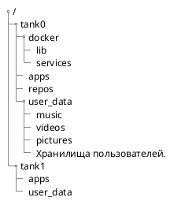
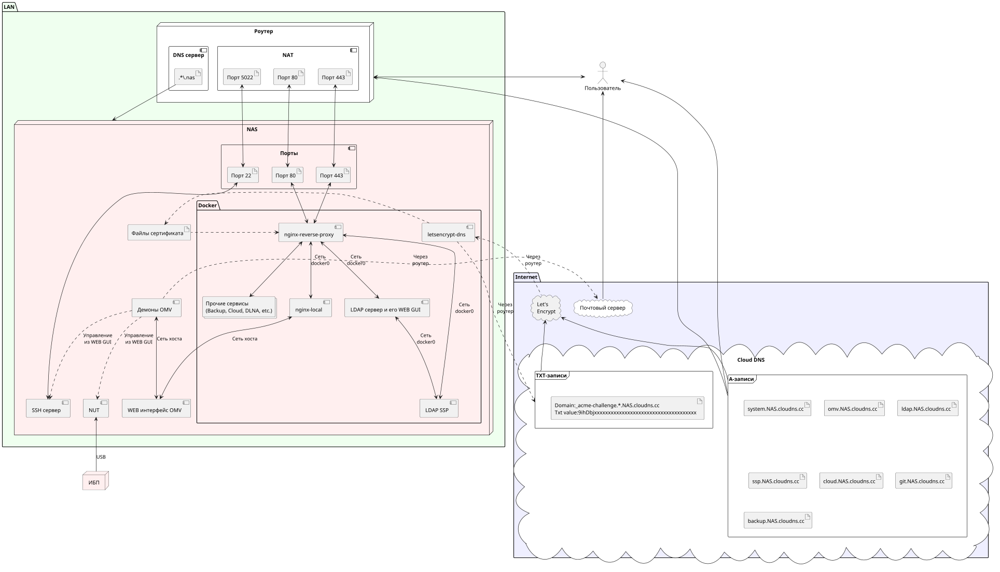
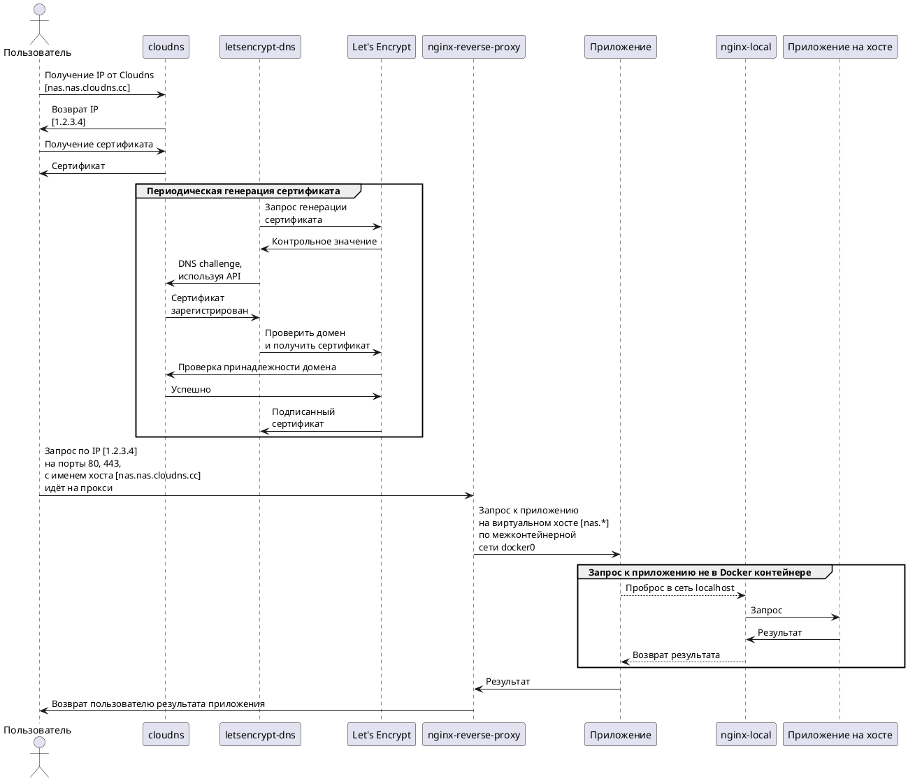

# Проектирование программной платформы защищённого NAS


Допустим, [аппаратная часть NAS собрана](https://habr.com/post/353012/) и на неё установлена ОС, например, как показано [здесь](https://habr.com/post/351932/). И сейчас у вас есть работающий сервер с Debian, который загружается, подключен в сеть, и вы имеете к нему полный физический доступ.

Теперь надо спроектировать среду, позволяющую легко и безопасно добавлять, удалять прикладные сервисы, а также управлять их работой.

<cut/>

Вдохновившись [статьёй от некоего Cloud Architect](https://habr.com/post/328048/), я решил сделать систему, в которой большинство служб работают в контейнерах.

Кроме того, сходные методы (например, разделение пространств ввода-вывода путём контейнерной виртуализации) используются в достаточно ответственных [системах атомной индустрии](http://www.ndexpo.ru/mediafiles/u/files/materials_2017/Vladykin_NIIIS_ZPP_Sinergiya.pdf).

Это очень удобно и безопасно:

- Нет конфликтов зависимостей. Возможно держать в системе несколько разных версий Glibc, php, nginx и всего, что угодно, кроме ядра.
- Нет непонятно где разбросанных конфигураций.
- Службы легко останавливать, запускать, обновлять и т.д..
- В каждый контейнер легко добавить свои настройки и изменения, где бы они не находились, хоть в /usr. В "обычной ОС" пакетная система затрёт такие изменения и надо извращаться с хуками, чтобы они были постоянны.
- Контейнеры предоставляют высокую степень изоляции: одна скомпрометированная служба ещё не означает полного доступа ко всем остальным и, тем более, к системе.

Но в его варианте есть и то, что мне не понравилось:

- Proxmox здесь лишний. Во-первых, ради поддержки ZFS устанавливать его нет смысла, т.к. ОС с полной его поддержкой, включая корневую ФС, я устанавливаю вручную. Во-вторых, это NAS, а не сервер виртуальных машин, так что функциональность Proxmox избыточна. В-третьих, контейнерами и виртуальными машинами может управлять OpenMediaVault, а иметь две точки входа неудобно. Ну и, в-четвёртых **ядро Proxmox поддерживается OMV**, при подключении репозиториев [OMV Extras](http://omv-extras.org/), и заниматься пересборкой пакетов не нужно.
- Конфликты зависимостей - это один из самых больших минусов, которые несёт с собой использование Proxmox совместно с OpenMediaVault. Из-за этого приходится пересобирать пакеты, и затрудняются обновления.
- Устанавливать OMV 3-й версии, когда есть 4-я, в которой много переделано, сейчас уже не имеет смысла.
- nginx-proxy-companion для lets-encrypt у меня не заработал, и пришлось решать проблему сертификата другим методом.

В данной статье предложен вариант, который работает на моём NAS и пока меня вполне устраивает.

С целью повышения удобочитаемости, тема разбита на две статьи: проектирование и [реализация](https://habr.com/post/415779/).


Дисковая организация
--------------------

<spoiler title="Здесь я немного повторюсь и для полноты кратко приведу дисковую организацию системы.">
### Системные SSD

Под систему отведено две SSD, причём вторая SSD является зеркалом первой.

Структура данных на SSD:

- `part_boot` - раздел с загрузчиком. Размер = 1GB.
- `part_system` - раздел с системой. Размер = 32 GB (Рекомендованный размер: 16 GB * 2).
- `part_slog` - раздел с SLOG. Размер = 5 GB.
  SLOG не может быть более размера RAM = 32 GB + 48 GB swap = 80 GB, 16 GB с учётом возможного расширения swap).
  96 GB - абсолютный лимит.
  Обычным правилом для установки размера SLOG является выделение объёма не более того, который система может пропустить за 5 с.
  В случае платы с 2-мя 1G интерфейсами, SLOGsz = 1000 / 8 * 2 * 5 = 1250 MB.
  Размер с запасом выбран 5 GB.

`part_system` и `part_slog` зашифрованы в XTS режиме.

В целом, их организация такова:

```
SSD1: [part_boot] -> [zfs_mirror] <---> SSD2
SSD1: [part_system] -> [crypto_xts] -> [zfs_mirror] <---> SSD2
SSD1: [part_slog] -> [crypto_xts] -> [zfs_zil_mirror] <---> SSD2
```

Дублирование разделов производится средствами ZFS.


### SSD с кэшем L2ARC

Нижний слой зашифрован, используя XTS режим на случайном ключе.

Содержит два раздела:

- `part_swap` - раздел подкачки. Размер = 48 GB (max RAM \* 1.5 = 32 GB \* 1.5).
- `part_l2arc` - L2ARC. Размер = 196 GB (ARC size \* [3..10], ARC size = 0.6 \* max RAM size, т.е. 58 - 196 GB, кроме того, с выключенной дедупликацией нужно ~1 GB L2ARC на 1 TB данных).

swap и l2arc зашифрованы случайным ключом.

Случайный ключ для раздела подкачки приемлем, т.к. система не будет использовать режим гибернации.

Под L2ARC выделяется всё оставшееся место, его реальная нужность при размере памяти до 32 GB сомнительна.

Размер L2ARC требуется точнее настроить в процессе работы системы по статистике кэш-попаданий.

Организация:

```
SSD3: | -> [part_swap] -> [crypto_xts] -> [system swap]
      | -> [part_l2arc] -> [crypto_xts] -> [l2arc]
```
</spoiler>


### Дисковая корзина

Т.к. на первом этапе планировалось использовать 4 диска из 8-ми возможных, все диски в корзине включены в 2 ZFS VDEV.

Каждый диск первым имеет слой шифрования XTS. Поверх него организуется физическое устройство ZFS.

4 физических устройства объединены в один RAIDZ1. Если не жалко дискового пространства, либо устройств больше (например, планируется сразу закупить все диски), рекомендуется сделать RAIDZ2 и один массив.

<spoiler title="Замеры производительности.">

- Прямое копирование на диск блоками по 4 MB: 185 MB/s (dsync: 136 MB/s)
- LUKS раздел с поддержкой команд AES-NI: 184 MB/s (dsync: 135 MB/s)
- ZFS volume = 170 MB/s (dsync: 50 MB/s).
- LUKS on ZFS volume = 274 MB/s (dsync: 38 MB/s).
- ZFS on LUKS = 187 MB/s (dsync: 50 MB/s)

Отсюда вывод: всё-таки несмотря на "заверения экспертов" располагать ZFS pool лучше поверх LUKS, а не наоборот. LUKS почти не вносит оверхед (с AES-NI). А кэширование записи диска всегда возможно включить вручную (как и подобрать размер блока, который у ZFS, к тому же, переменный).

</spoiler>

Полная схема такова:

```
HDD1: [crypto_xts] -> [zfs_phdev] |
HDD2: [crypto_xts] -> [zfs_phdev] |
HDD3: [crypto_xts] -> [zfs_phdev] | -> [RAIDZ1] -> [tank0]
HDD4: [crypto_xts] -> [zfs_phdev] |

HDD5: [crypto_xts] -> [zfs_phdev] |
HDD6: [crypto_xts] -> [zfs_phdev] |
HDD7: [crypto_xts] -> [zfs_phdev] | -> [RAIDZ1] -> [tank1]
HDD8: [crypto_xts] -> [zfs_phdev] |
```


Организация файловых систем
---------------------------

### Структура пула

NAS будет содержать различные прикладные системы, описание которых приведено ниже.
Каждая система добавляет свой каталог в фиксированные точки структуры каталогов пула, но имена каталогов для каждой системы будут описаны при её проектировании.

Ниже приведена файловая структура пула, общая для всех систем:


<spoiler title="Код диаграммы">

</spoiler>

На диаграмме:

- `tank0/docker` - данные служб, запущенных в Docker.
  - `lib` - служебные файлы докера. Это отдельная ФС, и требуется для того, чтобы докер не засорял `/var` снэпшотами.
  - `services` - описание контейнеров (например, файлы dockercompose) и их служебные файлы.
- `tank0/apps` - хранилище является корнем, в котором создаются хранилища для пользовательских приложений. Внутри подкаталога для приложения, приложение вольно располагать данные так, как считает нужным.
- `tank0/repos` - репозитории. Здесь будут храниться пользовательские данные под версионным контролем. Поскольку я планирую использовать только Git, там будут содержатся непосредственно репозитории. Но вообще, в данном каталоге могут быть подкаталоги для разных систем контроля версий.
- `tank0/user_data` - хранилище является корнем, в котором создаются хранилища для пользовательских данных:
  - books - здесь хранится пользовательская библиотека.
  - music - музыка пользователей.
  - videos - видео.
  - pictures - различные изображения и фотографии.
  - Хранилища пользователей (по их именам).
- `tank1/apps` - хранилище является корнем, в котором создаются хранилища для пользовательских приложений. Повторяет структуру в `tank0`.
- `tank1/user_data` - хранилище является корнем, в котором создаются хранилища для пользовательских данных. Повторяет структуру в `tank0`.

Хранилище `tank1` выделено на перспективу: оно будет реализовано в случае расширения дискового пространства.


## Состав системного ПО и взаимодействие компонентов

Так выглядит NAS в контексте взаимодействующих с ним систем:

[](images/5-rqv1ragvekziaermc8gt7fa4e.png)

<spoiler title="Код диаграммы">

</spoiler>

На этой загромождённой диаграмме отражён состав его служб и большинство взаимодействий.
Далее компоненты, назначение служб и алгоритмы функционирования будут расписаны подробнее.


### Операционная система

Система, как было показано выше,  установлена на SSD, включённых в зеркало средствами ZFS. В качестве ОС выбран [OpenMediaVault](www.openmediavault.org) - система управления хранилищем и WEB GUI (далее - OMV).

Его достаточно просто установить пакетом, а всё остальное будет подтянуто по зависимостям: ядро, дополнительные репозитории и т.п..


### Системное ПО

Центральными компонентами являются:

- [Nginx proxy](https://github.com/jwilder/nginx-proxy) - диспетчер с автоматическим управлением сертификатами (посредством отдельного механизма).
- [Docker](https://www.docker.com) - система контейнеризации. Обеспечивает удобную работу с контейнерами: загрузку образов, сборку, конфигурирование и т.п.. Для управления контейнерами используется плагин OMV.

На физической машине работает только OMV, SSH и демоны, к которым не обращается пользователь. Все остальные системы работают внутри Docker-контейнеров.


### Управление пользователями

Аутентификация пользователей производится посредством LDAP. Это сделано потому, чтобы управлять пользователями централизованно, и большинство сервисов поддерживает этот механизм, в отличие от, например [RADIUS сервера](https://ru.wikipedia.org/wiki/RADIUS) и подобных пусть и более удобных, новых и легковесных решений.

LDAP сервер работает в контейнере, но обращение к нему доступно также из сети хоста.
Сервисы (gitlab, OMV, облако и т.д.) настраиваются на использование LDAP сервера.
Менять пароли пользователи могут с использованием [LDAP Self Service Password](https://ltb-project.org/documentation/self-service-password).

Пользователя при добавлении в систему предварительно нужно зарегистрировать, используя консоль, либо WEB-интерфейс. Я использую [PHP LDAP Admin](http://phpldapadmin.sourceforge.net/wiki/index.php/Main_Page).

При желании дать пользователям права на действия с ОС, возможно использовать [PAM LDAP](https://wiki.debian.org/LDAP/PAM).


### Сеть

#### Физическая организация

Как видно на диаграмме развёртывания, NAS находится за роутером в локальной сети. В идеале, с целью повышения безопасности сети, неплохо бы изолировать его в DMZ с использованием второго роутера, но это не обязательно.

Пользователь может обращаться к NAS как из сети Интернет, так и из локальной сети. Любое обращение затрагивает роутер.

Т.к. система имеет несколько интерфейсов, к роутеру подключено более одного одновременно (в моём случае два) и организован их [бондинг](https://ru.wikipedia.org/wiki/Агрегирование_каналов).

Во-первых, интерфейсы в таком случае не простаивают без дела.
Во-вторых, это повышает надёжность, а в некоторых режимах и пропускную способность.


#### Логическая организация

Как возможно видеть из диаграммы, в работе системы принимает участие роутер.

В случае доступа из внешней сети, роутер организует проброс портов. Порты 80 и 443 служат для организации доступа к сервисам по HTTP и HTTPS соответственно. Порт 5022 пробрасывается на порт 22 NAS для доступа по SSH. В идеале лучше иметь некую дисциплину назначения номеров портов: например, порты 10001-10999 назначаются для доступа к сервисам хоста в NAS, порты 110001-11999 назначаются для доступа ко второму домашнему серверу и т.п..

При доступе из Интернета нужно иметь возможность привязать несколько доменных имён к своему IP. Это реализуется разными способами, но я использую вариант с облачным DNS, предоставляющим DNS зону. В качестве такового, был применён [ClouDNS](https://www.cloudns.net).

В случае доступа из локальной сети, роутер предоставляет DNS сервер. Если перенести DNS сервер с роутера на NAS, система будет полностью автономной. Но это не имеет особого смысла, т.к. без функционирующего роутера, который служит для организации локальной сети (в том числе, и подключения NAS в сеть) и связи с внешними сетями, нормально пользоваться NAS всё-равно не получится.

У его DNS сервера должна быть возможность возвращать определённый IP, если имя попадает под регулярное выражение.

Для NAS там есть две записи: "`.*\.nas`" и "`.*\.NAS\.cloudns\.cc`", где NAS - зарегистрированная в ClouDNS зона.

В результате, независимо от того, есть ли Интернет, роутер перенаправит все обращения из локальной сети к доменам в зоне NAS.cloudns.cc на NAS.

HTTP запрос, попав на порт NAS 80 или 443, перенаправляется на порт контейнера с nginx-reverse-proxy.

Он возвращает пользователю подписанный сертификат для безопасного доступа по HTTPS. Затем, в зависимости от доменного имени, переадресует запрос контейнеру с нужной службой. Например, запрос на cloud.NAS.cloudns.cc будет перенаправлен контейнеру, в котором работает персональное облако.

Есть два типа служб:

- Службы, работающие в контейнерах. Их форнтэнд разделяет ту же сеть, что и nginx-reverse-proxy. Здесь перенаправление организуется напрямую.
- Службы, работающие на хосте. Например, WEB-интерфейс OMV работает прямо на хосте, не в контейнере и недоступен напрямую из внешней сети по порту 443 (просто потому, что данный порт слушает nginx-reverse-proxy).

В случае служб второго типа, перенаправление организуется через контейнер nginx-local, содержащий шаблоны доменных имён "железного" хоста.

Процесс прохождения запроса внутри NAS показан на диаграмме ниже. Процесс обновления сертификата, указанный на диаграмме, описан далее.

[](images/fe-mcovzkawnlfrnhxfh2ef_ch8.png)

<spoiler title="Код диаграммы">

</spoiler>


#####  Сертификат

Периодически контейнер с letsencrypt-dns получает сертификат для группы доменов. Получение сертификата реализуется с использованием [certbot](https://certbot.eff.org/). Перед получением сертификата, сервис Let's Encrypt производит проверку того, принадлежит ли домен тому, кто запрашивает на него сертификат.

С случае с ClouDNS, это делается с использованием так называемого [DNS challenge](https://github.com/Neilpang/acme.sh/blob/master/README.md):

- Генерируется случайная последовательность.
- Последовательность вставляется в TXT запись.
- Let's Encrypt проверяет, что такая последовательность действительно присутствует.

Вставка в TXT запись может производиться вручную, а может с использованием API. Для того, чтобы унифицировать доступ к разным DNS провайдерам, существует библиотека и инструмент [Lexicon](https://github.com/AnalogJ/lexicon).

К сожалению, у ClouDNS существует минус: его API платное. С учётом того, сертификат я приделал не сразу, и мне не хотелось всё переделывать, я просто купил доступ, который стоит $42 за 2 года (да и зажимать сорок баксов, при совокупной цене NAS более $3000 было бы странно).

При желании возможно найти нормальные сервисы с бесплатным API.


#### Сетевые сервисы

Инфраструктурные сервисы, касающиеся сети, которые требуются для функционирования и обслуживания:

- Nginx-reverse-proxy является диспетчером, передающим сервису данные по его URL.
- Lets-encrypt для обновления сертификатов.
- Nginx, проксирующий запросы в сеть хоста из сети контейнеров.
- Управление по SSH организовано с использованием OpenSSH.
- DNS сервер, как уже было сказано, **не будет** входить в состав NAS. Для того, чтобы сделать NAS полностью автономным, он конечно не помешает. Но с учётом того, что NAS не нужен без сети, его возможно реализовать на роутере.
- POP3/SMTP сервер, указанный на диаграмме, является внешним и нужен для посылки оповещений от NAS.

Возможно использовать nginx-proxy-companion для получения сертификатов, но он у меня не заработал.


Взаимодействие с источником питания
-----------------------------------

В качестве ядра системы управления питанием был выбран демон [NUT](https://networkupstools.org), который поддерживается плагином OMV и которому нет серьёзных универсальных альтернатив.

Соответственно, источник бесперебойного питания [Eaton](http://powerquality.eaton.ru/Products-services/Backup-Power-UPS/9130.aspx) был изначально выбран так, чтобы проблем в связке Linux+NUT с ним не возникало.

Eaton-ы, в данном случае вообще [очень хорошо поддерживаются](https://networkupstools.org). Единственный серьёзный его недостаток - это шум. Но он легко исправляется заменой вентилятора, что было описано в "железной" статье.

Для того, чтобы NAS правильно взаимодействовал и ИБП требуется настроить реакции на события, которые описаны ниже.

При достижении батареей ИБП предела срока службы, выполняется:

- Сигнализация в WEB-интерфейсе. За это отвечает плагин и требование не обязательное.
- Отправка сообщения на e-mail каждые 24 часа. Также реализуется через OMV.

При отключении питающей сети на время более 1 минуты, выполняется:

- Сигнализация в WEB-интерфейсе.
- Отправка сообщения по e-mail.

При понижении заряда батареи ниже критического, выполняется:

- Отправка сообщения на e-mail.
- Завершение работы системы.


Средства защиты от НСД
----------------------

Здесь приведены только общие меры безопасности, касающиеся именно NAS:

- Все пользователи авторизуются: анонимного доступа нет. В дальнейшем от такой схемы возможно несколько отступить. Ссылки на файлы в облаке могут быть предоставлены сторонними пользователями.
- Реализовано полнодисковое шифрование. В том числе, шифруется корневая файловая система.
- Установлена парольная защита на системные установки посредством EFI.
- Система доверенной загрузки. Является дополнительным средством контроля аутентичности загрузчика.
- Возможна двуфакторная аутентификация в виде токена, но это пока не реализуется.
- Используется файрволл.
- В качестве дополнительной меры защиты от брутфорса возможно использовать [fail2ban](https://www.fail2ban.org/wiki/index.php/Main_Page).
- Внедрение системы мандатного контроля доступа также повысит сложность удалённого взлома и может частично нивелировать его последствия.


Средства повышения надёжности
-----------------------------

Для того, чтобы понизить вероятность отказа системы, используются:

- Оповещения по e-mail (как удалённые, так и локальные) обо всём: выключение питания, вскрытие, проблемы SMART.
- Мониторинг SMART.
- Изоляция приложений.
- Средства дополнительного резервирования. Например, репликация данных в облачное хранилище.

В случае достижения параметров SMART какого-либо диска критических значений, выполняется:

- Сигнализация в WEB интерфейсе.
- Отправка сообщения на e-mail.
- При возможности, вывод диска из пула.


Управление системой
-------------------

Управление ПО системы осуществляется через:

- WEB интерфейс доступный через HTTPS.
- SSH. У меня есть привычка работать через консоль, и SSH крайне желателен.
- IPMI: управление системой, при незагруженной ОС.


### WEB интерфейс

Система предоставляет основные сервисы, доступные по HTTPS (в зоне NAS.cloudns.cc из Интернет, либо в зоне nas в локальной сети) :

- https://nas.nas, https://omv.nas - интерфейс системы управления хранилищем.
- https://ssp.nas - интерфейс для смены пароля пользователя.
- https://ldap.nas - интерфейс администратора LDAP сервера.

Дополнительные подсистемы будут добавлять свои интерфейсы, которые описываются таким же образом.


Организация прикладных систем
-----------------------------

Предварительный состав систем:

- Система работы с кодом.
- Резервное копирование.
- Облачное хранилище.
- Загрузка содержимого из Интернет.
- Медиасистема.

Каждая из систем будет описана отдельно.


Служебные компоненты
--------------------

### СУБД

Т.к. СУБД требуется для большинства систем, на начальном этапе было желание выбрать одну СУБД, на основе возможностей и требований подсистем, и запустить в единственном экземпляре. Но в итоге, выяснилось, что использовать несколько СУБД, в зависимости от реализации подсистемы, проще и не особенно затратно по ресурсам. На этом варианте я пока остановился.


### Система дополнительного резервирования

Задачи данной системы:

- Дублирование конфигурации ОС и систем. Конфигурация резервируется в пул данных.
- Сохранение промежуточных состояний как корневого пула, так и пула данных.

Состав:

- Плагин OMV backup. Отвечает за резервирование конфигурации ОС.
- zfs-auto-snapshot. Отвечает за сохранение промежуточных состояний пулов, используя ZFS снимки.


## Что не сделано

- Это статья, в которой описано конкретное проектное решение, а не проектная документация, потому "проектирование" здесь выполнено относительно неформально. Тем не менее, этого достаточно, чтобы реализовать описанную систему. Реализация будет показана далее.
- По той же причине не построена модель угроз. В данном случае, проект для личного пользования, и модель угроз подразумевается неявно. Желающим построить формальную модель, могу порекомендовать [документ ФСТЭК](https://fstec.ru/component/attachments/download/289), а также ознакомление с [Microsoft SDL](https://www.microsoft.com/en-us/sdl). Если будет много желающих, могу написать отдельную статью по построению модели угроз для данной системы.
- Многие моменты оставлены до этапа реализации, а также отражены не все особенности системы безопасности.
- В случае длительного отключения питания (более 40 минут), систему придётся включать вручную, и я на это несколько раз попадал. Чтобы это преодолеть, есть возможность вывести в Интернет интерфейс к IPMI, но решать делать так или нет, за того, кто делает NAS по такой схеме, я не буду (для справки в IME [уже находили уязвимости](https://www.ixbt.com/news/2017/11/13/intel-management-engine.html), а также развивается [утилита по зачистке IME](https://github.com/corna/me_cleaner)).
