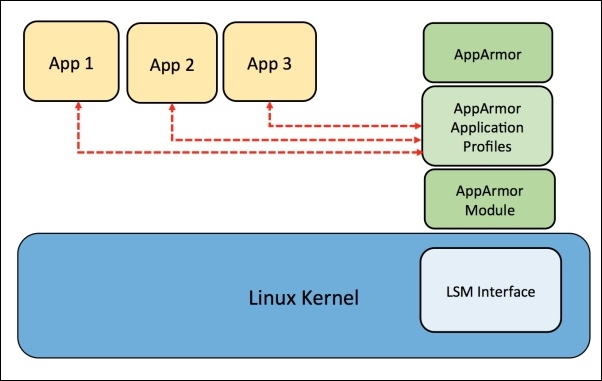
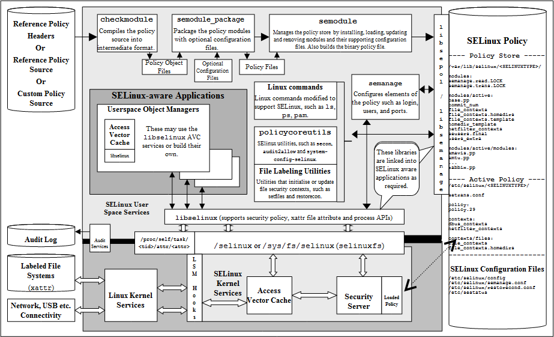

# Дополнительные программные средства безопасности для NAS


Цикл статей назван ["Построение защищённого NAS"](https://habr.com/post/359346/). Поэтому в данной статье будет рассматриваться повышение уровня защищённости. Также, будут описаны и те инструменты, которые я не использовал, но возможно применить.

<cut/>

## Кто и как?

Кто собирается атаковать систему и как он будет это делать?

Обычно, это первый вопрос, на который требуется ответить, прежде чем говорить о безопасности.
По крайне мере, в случае NAS неявно такой ответ уже есть. Но для того, чтобы полностью ответить на данный вопрос, строят модель угроз и модель нарушителя.

Компании закладывают  этап моделирования угроз в свои циклы разработки.
У Microsoft для этого есть [SDL](https://ru.wikipedia.org/wiki/Security_Development_Lifecycle), у людей [есть и другие модели](https://www.owasp.org/index.php/OWASP_SAMM_Project).

Они предполагают использование определённых методик, таких как [STRIDE](https://en.wikipedia.org/wiki/STRIDE_(security)) или [DREAD](https://en.wikipedia.org/wiki/DREAD_(risk_assessment_model)) (STRIDE всё-таки более общий и неплохо поддержан инструментально).

В STRIDE, например, модель строится от потоков данных и получается обычно большой, тяжёлой и мало понятной. Тем не менее, инструмент предоставляет список потенциальных угроз, что облегчает их рассмотрение.

Модель угроз является закрытой информацией, потому что облегчает атакующему анализ системы и поиск слабых мест. Если он получает модель, ему не придётся строить её самостоятельно, ведь аналитики уже обо всём позаботились.

**Это была минутка рекламы.**


Так строят модель серьёзные компании. И если это интересно, я могу как-нибудь описать в отдельной статье.

Здесь же я опишу то, что по-английски называется ["hardening"](https://en.wikipedia.org/wiki/Hardening_(computing)) и займусь устранением недоработок безопасности, которые были допущены в процессе постройки системы.

В основном, поддержание безопасности на данном уровне осуществляется за счёт закрытия известных уязвимостей системы, наблюдения за ней и периодической проверки.


## Литература по теме

Что почитать:

- Стоит начать с [проекта Hardened Linux](https://github.com/hardenedlinux), где желающие найдут [много полезного](https://github.com/hardenedlinux/Debian-GNU-Linux-Profiles).
- Пакет harden-doc содержит [Securing Debian Manual](https://www.debian.org/doc/manuals/securing-debian-howto/index.en.html) старый 2012 года, но пробежаться не мешает для понимания вопроса.
- Затем, читайте краткое пошаговое руководство [Debian 8 Hardening](https://gist.github.com/vivianspencer/bc86e2765fc4df09795e).
- Ну и напоследок, [маленькое руководство по Hardening deb пакетов](https://wiki.debian.org/HardeningWalkthrough) и [кода на C/C++](https://wiki.debian.org/Hardening), что вам, скорее всего, не пригодится.


## Снапшоты и докер

Ранее, был установлен zfs-autosnapshot. Он мне неоднократно помогал, т.к. я мог восстанавливать испорченные конфигурации (для Nextcloud, к примеру) из снэпшотов.
Однако, со временем, система начала притормаживать, а снапшотов расплодилось несколько тысяч.

Выяснилось, что при создании родительской файловой системы для контейнеров, я забыл выставить флаг `com.sun:auto-snapshot=false`.

В [оригинальной статье](https://habr.com/post/415779/) данная проблема уже исправлена, здесь же я покажу, как избавиться от лишних снэпшотов.

<spoiler title="Подробнее, как исправить ошибку.">
Сначала надо выключить zfs-auto-snapshot на родительской файловой системе докера:

```
zfs set com.sun:auto-snapshot=false tank0/docker/lib
```

Теперь удалите неиспользуемые контейнеры и образы:

```
docker container prune
docker image prune
```

Произведите удаление снэпшотов:

```
zfs list -t snapshot -o name -S creation | grep -e ".*docker/lib.*@zfs-auto-snap" | tail -n +1500 | xargs -n 1 zfs destroy -vr
```

И выключите их на всех файловых системах образов:

```
zfs list -t filesystem -o name -S creation | grep -e "tank0/docker/lib" | xargs -n 1 zfs set com.sun:auto-snapshot=false
```

Подробнее возможно почитать [здесь](https://www.1stbyte.com/2012/11/24/exclude-zfs-filesystems-from-zfs-auto-snapshot-on-ubuntu-and-remove-them/).
</spoiler>


## LDAP

В прошлый раз был создан только один пользователь LDAP, обладающий администраторской ролью.

Но большинству сервисов не требуется что-то изменять в базе пользователей. Потому, неплохо бы добавить пользователя только для чтения. Чтобы не заниматься созданием ролей вручную, возможно использовать скрипт инициализации контейнера.

Сначала, добавьте в `docker-compose.yml` настройки для включения пользователя только для чтения:

```
- "LDAP_READONLY_USER=true"
- "LDAP_READONLY_USER_USERNAME=readonly"
- "LDAP_READONLY_USER_PASSWORD=READONLY_PASSWORD"
```

Полный файл под спойлером.
<spoiler title="docker-compose.yml">
```
version: "2"

networks:
  ldap:
  docker0:
    external:
      name: docker0

services:
  open-ldap:
    image: "osixia/openldap"
    hostname: "open-ldap"
    restart: always
    environment:
      - "LDAP_ORGANISATION=NAS"
      - "LDAP_DOMAIN=nas.nas"
      - "LDAP_ADMIN_PASSWORD=ADMIN_PASSWORD"
      - "LDAP_CONFIG_PASSWORD=CONFIG_PASSWORD"
      - "LDAP_READONLY_USER=true"
      - "LDAP_READONLY_USER_USERNAME=readonly"
      - "LDAP_READONLY_USER_PASSWORD=READONLY_PASSWORD"
      - "LDAP_TLS=true"
      - "LDAP_TLS_ENFORCE=false"
      - "LDAP_TLS_CRT_FILENAME=ldap_server.crt"
      - "LDAP_TLS_KEY_FILENAME=ldap_server.key"
      - "LDAP_TLS_CA_CRT_FILENAME=ldap_server.crt"
    volumes:
      - ./certs:/container/service/slapd/assets/certs
      - ./ldap_data/var/lib:/var/lib/ldap
      - ./ldap_data/etc/ldap/slapd.d:/etc/ldap/slapd.d
    networks:
      - ldap
    ports:
      - 172.21.0.1:389:389
      - 172.21.0.1:636:636

  phpldapadmin:
    image: "osixia/phpldapadmin:0.7.1"
    hostname: "nas.nas"
    restart: always
    networks:
      - ldap
      - docker0
    expose:
      - 443
    links:
      - open-ldap:open-ldap-server
    volumes:
      - ./certs:/container/service/phpldapadmin/assets/apache2/certs
    environment:
      - VIRTUAL_HOST=ldap.*
      - VIRTUAL_PORT=443
      - VIRTUAL_PROTO=https
      - CERT_NAME=NAS.cloudns.cc

      - "PHPLDAPADMIN_LDAP_HOSTS=open-ldap-server"
      #- "PHPLDAPADMIN_HTTPS=false"
      - "PHPLDAPADMIN_HTTPS_CRT_FILENAME=certs/ldap_server.crt"
      - "PHPLDAPADMIN_HTTPS_KEY_FILENAME=private/ldap_server.key"
      - "PHPLDAPADMIN_HTTPS_CA_CRT_FILENAME=certs/ldap_server.crt"
      - "PHPLDAPADMIN_LDAP_CLIENT_TLS_REQCERT=allow"

  ldap-ssp:
    image: openfrontier/ldap-ssp:https
    volumes:
      - /etc/ssl/certs/ssl-cert-snakeoil.pem:/etc/ssl/certs/ssl-cert-snakeoil.pem
      - /etc/ssl/private/ssl-cert-snakeoil.key:/etc/ssl/private/ssl-cert-snakeoil.key
    restart: always
    networks:
      - ldap
      - docker0
    expose:
      - 80
    links:
      - open-ldap:open-ldap-server
    environment:
      - VIRTUAL_HOST=ssp.*
      - VIRTUAL_PORT=80
      - VIRTUAL_PROTO=http
      - CERT_NAME=NAS.cloudns.cc

      - "LDAP_URL=ldap://open-ldap-server:389"
      - "LDAP_BINDDN=cn=admin,dc=nas,dc=nas"
      - "LDAP_BINDPW=ADMIN_PASSWORD"
      - "LDAP_BASE=ou=users,dc=nas,dc=nas"
      - "MAIL_FROM=admin@nas.nas"
      - "PWD_MIN_LENGTH=8"
      - "PWD_MIN_LOWER=3"
      - "PWD_MIN_DIGIT=2"
      - "SMTP_HOST="
      - "SMTP_USER="
      - "SMTP_PASS="
```
</spoiler>

Затем, надо сделать дамп и удалить:

```
$ cd /tank0/docker/services/ldap
$ tar czf ~/ldap_backup.tgz .
$ ldapsearch -Wx -D "cn=admin,dc=nas,dc=nas" -b "dc=nas,dc=nas" -H ldap://172.21.0.1 -LLL > ldap_dump.ldif
$ docker-compose down
$ rm -rf ldap_data
$ docker-compose up -d
```

Чтобы сервер при восстановлении из дампа не ругался на дублирующиеся элементы, в файле надо удалить строки:

```
dn: dc=nas,dc=nas 
objectClass: top 
objectClass: dcObject 
objectClass: organization 
o: NAS 
dc: nas 
 
dn: cn=admin,dc=nas,dc=nas 
objectClass: simpleSecurityObject 
objectClass: organizationalRole 
cn: admin 
description: LDAP administrator 
userPassword:: PASSWORD_BASE64

```

И восстановить пользователей и группы:

```
$ ldapadd -Wx -D "cn=admin,dc=nas,dc=nas" -H ldap://172.21.0.1 -f ldap_dump.ldif
```

В базе появится такой вот зверь:

```
dn: cn=readonly,dc=nas,dc=nas
cn: readonly
objectClass: simpleSecurityObject
objectClass: organizationalRole
userPassword:: PASSWORD_BASE64
description: LDAP read only user
```

Роли в конфигурации LDAP-сервера для него будут созданы контейнером.
Выполните проверки после восстановления и удалите бэкап:

```
$ rm ~/ldap_backup.tgz
```


### Добавление групп в LDAP

Удобным является разделение пользователей LDAP на группы, аналогичные POSIX группам в Linux.
Например, возможно создать группы, пользователи которых будут иметь доступ к репозиториям, доступ к облаку, либо доступ к медиатеке.

Группы легко добавляются в phpLDAPAdmin, и я не буду на этом заострять внимание.

Замечу лишь следующее:

- Группа создаётся из шаблона "Default". Это **не POSIX** группа, а группа имён.
- Соответственно, группа имеет атрибут `objectClass`, включающий значение `groupOfUniqueNames`.

[](images/txi8yjxxtbvlzynr1yttkn-ddgc.png)


## Docker

В Docker уже почти всё сделано за вас.
По умолчанию он использует [ограничение на системные вызовы](https://docs.docker.com/engine/security/seccomp), которое включено в ядре OMV:

```
# grep SECCOMP /boot/config-4.16.0-0.bpo.2-amd64 
CONFIG_HAVE_ARCH_SECCOMP_FILTER=y
CONFIG_SECCOMP_FILTER=y
CONFIG_SECCOMP=y
```

[Здесь](https://docs.docker.com/engine/security/security/) возможно почитать о базовых правилах безопасности Docker чуть подробнее.
Также, если будет включен AppArmor, Docker может интегрироваться с ним и [пробрасывать его профили в контейнер](https://docs.docker.com/engine/security/apparmor).


## Сеть

### Устранение возможности обнаружения ОС

Сеть находится за роутером, но возможно проделать любопытное упражнение, изменив некоторые параметры сетевого стека так, чтобы ОС нельзя было опознать по ответам.
Реальной пользы от этого мало, ведь атакующий будет изучать баннеры сервисов и всё-равно поймёт, что за ОС вы используете.

<spoiler title="Nmap показывает, какая ОС функционирует на устройстве.">
```
# nmap -O localhost

Starting Nmap 7.40 ( https://nmap.org ) at 2018-08-26 14:39 MSK
Nmap scan report for localhost (127.0.0.1)
Host is up (0.000015s latency).
Other addresses for localhost (not scanned): ::1
Not shown: 992 closed ports
PORT     STATE SERVICE
53/tcp   open  domain
80/tcp   open  http
443/tcp  open  https
5432/tcp open  postgresql
Device type: general purpose
Running: Linux 3.X|4.X
OS CPE: cpe:/o:linux:linux_kernel:3 cpe:/o:linux:linux_kernel:4
OS details: Linux 3.8 - 4.6
Network Distance: 0 hops

OS detection performed. Please report any incorrect results at https://nmap.org/submit/ .
Nmap done: 1 IP address (1 host up) scanned in 4.07 seconds
```
</spoiler>

Загрузка настроек из sysctl.conf:

```
# sysctl -p /etc/sysctl.conf 
net.ipv4.conf.all.accept_redirects = 0
net.ipv6.conf.all.accept_redirects = 0
net.ipv4.conf.all.send_redirects = 0
net.ipv4.conf.all.accept_source_route = 0
net.ipv6.conf.all.accept_source_route = 0
net.ipv4.tcp_rfc1337 = 1
net.ipv4.ip_default_ttl = 128
net.ipv4.icmp_ratelimit = 900
net.ipv4.tcp_synack_retries = 7
net.ipv4.tcp_syn_retries = 7
net.ipv4.tcp_window_scaling = 1
net.ipv4.tcp_timestamps = 1
```

И вот...

<spoiler title="Nmap не может определить ОС.">
```
# nmap -O localhost

Starting Nmap 7.40 ( https://nmap.org ) at 2018-08-26 14:40 MSK
Nmap scan report for localhost (127.0.0.1)
Host is up (0.000026s latency).
Other addresses for localhost (not scanned): ::1
Not shown: 992 closed ports
PORT     STATE SERVICE
53/tcp   open  domain
80/tcp   open  http
443/tcp  open  https
5432/tcp open  postgresql
No exact OS matches for host (If you know what OS is running on it, see https://nmap.org/submit/ ).
TCP/IP fingerprint:
OS:SCAN(V=7.40%E=4%D=8/26%OT=53%CT=1%CU=43022%PV=N%DS=0%DC=L%G=Y%TM=5B8291C
OS:3%P=x86_64-pc-linux-gnu)SEQ(SP=FA%GCD=1%ISR=105%TI=Z%CI=I%TS=8)OPS(O1=MF
OS:FD7ST11NW7%O2=MFFD7ST11NW7%O3=MFFD7NNT11NW7%O4=MFFD7ST11NW7%O5=MFFD7ST11
OS:NW7%O6=MFFD7ST11)WIN(W1=AAAA%W2=AAAA%W3=AAAA%W4=AAAA%W5=AAAA%W6=AAAA)ECN
OS:(R=Y%DF=Y%T=80%W=AAAA%O=MFFD7NNSNW7%CC=Y%Q=)T1(R=Y%DF=Y%T=80%S=O%A=S+%F=
OS:AS%RD=0%Q=)T2(R=N)T3(R=N)T4(R=Y%DF=Y%T=80%W=0%S=A%A=Z%F=R%O=%RD=0%Q=)T5(
OS:R=Y%DF=Y%T=80%W=0%S=Z%A=S+%F=AR%O=%RD=0%Q=)T6(R=Y%DF=Y%T=80%W=0%S=A%A=Z%
OS:F=R%O=%RD=0%Q=)T7(R=Y%DF=Y%T=80%W=0%S=Z%A=S+%F=AR%O=%RD=0%Q=)U1(R=Y%DF=N
OS:%T=80%IPL=164%UN=0%RIPL=G%RID=G%RIPCK=G%RUCK=G%RUD=G)IE(R=Y%DFI=N%T=80%C
OS:D=S)

Network Distance: 0 hops

OS detection performed. Please report any incorrect results at https://nmap.org/submit/ .
Nmap done: 1 IP address (1 host up) scanned in 19.52 seconds
```
</spoiler>

Эти настройки требуется прописать в `/etc/sysctl.conf`, тогда при каждой перезагрузке они будут читаться автоматически.

<spoiler title="Полный /etc/sysctl.conf">
```
###################################################################
# Additional settings - these settings can improve the network
# security of the host and prevent against some network attacks
# including spoofing attacks and man in the middle attacks through
# redirection. Some network environments, however, require that these
# settings are disabled so review and enable them as needed.
#
# Do not accept ICMP redirects (prevent MITM attacks)
net.ipv4.conf.default.accept_redirects = 0
net.ipv6.conf.default.accept_redirects = 0
net.ipv4.conf.all.accept_redirects = 0
net.ipv6.conf.all.accept_redirects = 0
# _or_
# Accept ICMP redirects only for gateways listed in our default
# gateway list (enabled by default)
# net.ipv4.conf.all.secure_redirects = 1
#
# Do not send ICMP redirects (we are not a router)
net.ipv4.conf.all.send_redirects = 0
#
# Do not accept IP source route packets (we are not a router)
net.ipv4.conf.all.accept_source_route = 0
net.ipv6.conf.all.accept_source_route = 0

## protect against tcp time-wait assassination hazards
## drop RST packets for sockets in the time-wait state
## (not widely supported outside of linux, but conforms to RFC)
net.ipv4.tcp_rfc1337 = 1

#
# Log Martian Packets
#net.ipv4.conf.all.log_martians = 1
#

###################################################################
# Magic system request Key
# 0=disable, 1=enable all
# Debian kernels have this set to 0 (disable the key)
# See https://www.kernel.org/doc/Documentation/sysrq.txt
# for what other values do
#kernel.sysrq=1

###################################################################
# Protected links
#
# Protects against creating or following links under certain conditions
# Debian kernels have both set to 1 (restricted) 
# See https://www.kernel.org/doc/Documentation/sysctl/fs.txt
#fs.protected_hardlinks=0
#fs.protected_symlinks=0

vm.overcommit_memory = 1
vm.swappiness = 10

###################################################################
# Anti-fingerprinting.
#

# Def: 64.
net.ipv4.ip_default_ttl = 128

# Скорость генерации ICMP пакетов (по умолчанию 1000)
net.ipv4.icmp_ratelimit = 900

# Количество повторных отсылок пакетов, на которые не получен ответ.
# Def: 5.
net.ipv4.tcp_synack_retries = 7
# Def: 5.
net.ipv4.tcp_syn_retries = 7

# Изменять параметры TCP window и timespamp в соответствии с 1323.
net.ipv4.tcp_window_scaling = 1
net.ipv4.tcp_timestamps = 1

# Redis requirement.
net.core.somaxconn = 511
```
</spoiler>

Более полезна защита от определения версий сервисов, для чего атакующий также может использовать Nmap:

```
# nmap -sV -sR --allports --version-trace 127.0.0.1
```

<spoiler title="Результат не очень хороший для системы.">
```
Not shown: 991 closed ports
PORT     STATE SERVICE     VERSION
22/tcp   open  ssh         OpenSSH 7.4p1 Debian 10+deb9u3 (protocol 2.0)
25/tcp   open  smtp        Postfix smtpd
80/tcp   open  http        nginx 1.13.12
111/tcp  open  rpcbind     2-4 (RPC #100000)
139/tcp  open  netbios-ssn Samba smbd 3.X - 4.X (workgroup: WORKGROUP)
443/tcp  open  ssl/http    nginx 1.13.12
445/tcp  open  netbios-ssn Samba smbd 3.X - 4.X (workgroup: WORKGROUP)
3493/tcp open  nut         Network UPS Tools upsd
8000/tcp open  http        Icecast streaming media server 2.4.2
Service Info: Hosts:  nas.localdomain, NAS; OS: Linux; CPE: cpe:/o:linux:linux_kernel
Final times for host: srtt: 22 rttvar: 1  to: 100000
```
</spoiler>

Но с маскировкой сервисов не всё гладко:

- Для каждого сервиса здесь нужен индивидуальный подход.
- Не всегда доступна возможность убрать версию.

Например, для SSH возможно добавить опцию `DebianBanner no` в `/etc/ssh/sshd_confg`.

В результате:

```
22/tcp   open  ssh         OpenSSH 7.4p1 (protocol 2.0)
```

Лучше, увы, не получится: версия используется SSH для установления того, какие возможности поддерживаются, и сменить её возможно, только [пропатчив сервер](https://superuser.com/questions/782382/hide-ssh-version).


### Port-knocking

Не самая известная техника защиты, позволяющая удалённому пользователю, знающему секрет, подключиться к закрытому порту.
[Работа напоминает кодовый замок](https://en.wikipedia.org/wiki/Port_knocking): все знают, что на сервере работают служебные демоны, но "их там нет", пока не набран код.
Например, для того, чтобы подключиться к серверу SSH, пользователю нужно постучаться на порты UDP 7000, TCP 7007, и UDP 7777.
После этого, с его IP файрволл будет пускать на **закрытый** TCP порт 22.

Подробнее о том, как это работает, возможно почитать [здесь](https://habr.com/post/179219/). И [в руководстве для Debian](https://www.cyberciti.biz/faq/debian-ubuntu-linux-iptables-knockd-port-knocking-tutorial/).

Использовать не рекомендую, т.к. обычно достаточно fail2ban.


### Файрволл

Файрволл я настраиваю через Web GUI OpenMediaVault, что и вам рекомендую.

[](images/cva9eoxcbu4h8ut8cwrwczkjop8.png)

Открывайте необходимые порты, такие  как 443 и 22, остальные - по вкусу. Также, желательно включить протоколирование отброшенных пакетов.


### SSH

<spoiler title="Если SSH висит на 22 порту, который открыт в Интернет, вы получите много интересных сообщений...">
```
# grep "invalid user" /var/log/auth.log|head
Aug 26 00:07:57 nas sshd[29786]: input_userauth_request: invalid user test [preauth]
Aug 26 00:07:59 nas sshd[29786]: Failed password for invalid user test from 185.143.160.137 port 51268 ssh2
Aug 26 00:11:01 nas sshd[5641]: input_userauth_request: invalid user 0 [preauth]
Aug 26 00:11:01 nas sshd[5641]: Failed none for invalid user 0 from 5.188.10.180 port 49025 ssh2
Aug 26 00:11:04 nas sshd[5644]: input_userauth_request: invalid user 0101 [preauth]
Aug 26 00:11:06 nas sshd[5644]: Failed password for invalid user 0101 from 5.188.10.180 port 59867 ssh2
Aug 26 00:32:55 nas sshd[20367]: input_userauth_request: invalid user ftp [preauth]
Aug 26 00:32:56 nas sshd[20367]: Failed password for invalid user ftp from 5.188.10.144 port 47981 ssh2
Aug 26 00:32:57 nas sshd[20495]: input_userauth_request: invalid user guest [preauth]
Aug 26 00:32:59 nas sshd[20495]: Failed password for invalid user guest from 5.188.10.144 port 34202 ssh2
```
</spoiler>

Рискуя показаться банальным, я всё-таки напомню, что требуется:

- Строго запретить вход под root.
- Ограничить вход только для указанных пользователей.
- Изменить порт на нестандартный.
- Желательно отключить аутентификацию по паролю, оставив только ключ.

Почитать больше возможно, например [здесь](https://www.cyberciti.biz/tips/linux-unix-bsd-openssh-server-best-practices.html).

Всё это легко делается из интерфейса OpenMediaVault через меню "Сервисы -> SSH".
За исключением того, что порт я не менял на нестандартный, оставив в локальной сети 22, и просто заменив порт в NAT роутера.

<spoiler title="Вот такой интересный список перебираемых аккаунтов я составил, пока не изменил порт SSHD на отличный от 22.">
```
# grep "invalid user" /var/log/auth.log|sed 's/.*invalid user \([^ ]*\) .*/\1/'|sort|uniq

0
0101
1234
22
admin
ADMIN
administrateur
administrator
admins
alfred
amanda
amber
Anonymous
apache
avahi
backup@network
bcnas
benjamin
bin
cacti
callcenter
camera
cang
castis
charlotte
clamav
client
cristina
cron
CSG
cvsuser
cyrus
david
db2inst1
debian
debug
default
denis
elvira
erik
fabio
fax
ftp
ftpuser
gary
gast
GEN2
guest
I2b2workdata2
incoming
jboss
john
juan
matilda
max
mia
miner
muhammad
mysql
nagios
nginx
noc
office
oliver
operator
oracle
osmc
pavel
pi
pmd
postgres
PROCAL
prueba
RSCS
sales
sales1
scaner
selena
student07
sunos
support
sybase
sysadmin
teamspeak
telecomadmin
test
test1
test2
test3
test7
tirocu
token
tomcat
tplink
ubnt
ubuntu
user1
vagrant
victor
volition
www-data
xghwzp
xxx
zabbix
zimbra
```
</spoiler>

После того, как это сделано, попытки несанкционированного входа будут производиться гораздо реже.

Чтобы ещё улучшить ситуацию, возможно блокировать атакующих с определённых IP после нескольких попыток входа.

Для чего могут быть использованы:

- [Fail2ban](https://www.fail2ban.org/). Популярная утилита, которая работает не только для SSH, но и для множества других приложений.
- [Denyhosts](http://denyhosts.sourceforge.net/). Похож на fail2ban.
- [Sshguard](https://www.sshguard.net/), при желании можете попробовать использовать его, но я подробно им не интересовался.

Я использую fail2ban. Он будет производить мониторинг логов на предмет различных нежелательных действий со стороны определённых IP, и банить их, в случае превышения количества срабатываний:

<spoiler title="/var/log/fail2ban.log.">
```
2018-08-29 21:17:25,351 fail2ban.filter         [8650]: INFO    [sshd] Found 5.188.10.144
2018-08-29 21:17:25,473 fail2ban.actions        [8650]: NOTICE  [sshd] Ban 5.188.10.144
2018-08-29 21:17:27,359 fail2ban.filter         [8650]: INFO    [sshd] Found 5.188.10.144
2018-08-29 21:28:13,128 fail2ban.filter         [8650]: INFO    [sshd] Found 5.188.10.176
2018-08-29 21:28:13,132 fail2ban.filter         [8650]: INFO    [sshd] Found 5.188.10.176
2018-08-29 21:28:15,137 fail2ban.filter         [8650]: INFO    [sshd] Found 5.188.10.176
2018-08-29 21:28:20,145 fail2ban.filter         [8650]: INFO    [sshd] Found 5.188.10.176
2018-08-29 21:28:25,153 fail2ban.filter         [8650]: INFO    [sshd] Found 5.188.10.176
2018-08-29 21:28:25,421 fail2ban.actions        [8650]: NOTICE  [sshd] Ban 5.188.10.176
2018-08-29 21:30:05,272 fail2ban.filter         [8650]: INFO    [sshd] Found 5.188.10.180
2018-08-29 21:30:05,274 fail2ban.filter         [8650]: INFO    [sshd] Found 5.188.10.180
2018-08-29 21:30:13,285 fail2ban.filter         [8650]: INFO    [sshd] Found 5.188.10.180
2018-08-29 21:30:13,286 fail2ban.filter         [8650]: INFO    [sshd] Found 5.188.10.180
2018-08-29 21:30:15,289 fail2ban.filter         [8650]: INFO    [sshd] Found 5.188.10.180
2018-08-29 21:30:15,803 fail2ban.actions        [8650]: NOTICE  [sshd] Ban 5.188.10.180
```
</spoiler>

Бан производится через добавление правила файрволла. Через заданное время правило удаляется, и пользователь снова может попробовать авторизоваться.

Изначально включен только SSH, но возможно включить контроль логов Web-сервера и других сервисов, [хотя бы того же OMV](https://bintray.com/openmediavault-plugin-developers/erasmus-testing/openmediavault-fail2ban/view).
А также, вынести наружу логи из контейнеров и натравливать fail2ban на них тоже.

Рекомендую добавить сервисы по вкусу.
Подробнее о настройке вы можете почитать, например [здесь](https://vps.ua/wiki/install-linux-vps/security/configuring-fail2ban/) или на [родной Wiki](https://www.fail2ban.org/wiki/index.php/Main_Page).


## Логи

### [Lwatch](https://packages.debian.org/stretch/admin/lwatch)

Маленькая утилита, которую стоит установить для удобства. Подсветит логи и покажет их в красивом виде.
Возможно использовать [любую подобную утилиту](https://github.com/floriankraft/color-logviewer), главное, чтобы были подсвечены ошибки и проблемные места логов так, чтобы их визуальный разбор был облегчён.


### [Logcheck](http://logcheck.org/)

Стоит установить и настроить logcheck просто для того, чтобы при выявлении проблем с настройкой, о которых сообщается в логах, вы сразу увидели это в почте.
Он неплохо помогает увидеть, что идёт не так, хотя и требует настройки.

Установка:

```
# apt-get install logcheck
```

Сразу после установки он будет присылать отчёты.

<spoiler title="Пример отчёта.">
```
System Events
=-=-=-=-=-=-=
Oct  2 02:02:15 nas kernel: [793847.981226] [DROPPED] IN=br-ce OUT= PHYSIN=veth6c2a68e MAC=ff:ff:ff:ff:ff:ff: SRC=172.22.0.11 DST=255.255.255.255 LEN=29 TOS=0x00 PREC=0x00 TTL=64 ID=40170 DF PROTO=UDP SPT=35623 DPT=35622 LEN=9
Oct  2 02:02:20 nas hddtemp[13791]: /dev/sdh: Micron_1100 N              #020Ђ: 32 C
Oct  2 02:02:37 nas kernel: [793869.247128] [DROPPED] IN=br-7ba OUT= MAC= SRC=172.31.0.1 DST=172.31.255.255 LEN=239 TOS=0x00 PREC=0x00 TTL=128 ID=23017 DF PROTO=UDP SPT=138 DPT=138 LEN=219
Oct  2 02:02:37 nas kernel: [793869.247174] [DROPPED] IN=br-7ba OUT= MAC= SRC=172.31.0.1 DST=172.31.255.255 LEN=232 TOS=0x00 PREC=0x00 TTL=128 ID=23018 DF PROTO=UDP SPT=138 DPT=138 LEN=212
Oct  2 02:02:37 nas kernel: [793869.247195] [DROPPED] IN=br-673 OUT= MAC= SRC=192.168.224.1 DST=192.168.239.255 LEN=239 TOS=0x00 PREC=0x00 TTL=128 ID=8959 DF PROTO=UDP SPT=138 DPT=138 LEN=219
Oct  2 02:02:37 nas kernel: [793869.247203] [DROPPED] IN=br-673 OUT= MAC= SRC=192.168.224.1 DST=192.168.239.255 LEN=232 TOS=0x00 PREC=0x00 TTL=128 ID=8960 DF PROTO=UDP SPT=138 DPT=138 LEN=212
Oct  2 02:02:50 nas hddtemp[13791]: /dev/sdh: Micron_1100 N              #020Ђ: 32 C
```
</spoiler>

Видно, что здесь много лишнего, и дальнейшая настройка будет сводиться к его фильтрации.

Сначала надо выключить hddtemp, который не работает корректно из-за не ASCII символов в названии SSD.
После исправления файла hddtemp, сообщения перестали приходить:
<spoiler title="/etc/logcheck/ignore.d.server/hddtemp">
```
^\w{3} [ :0-9]{11} [._[:alnum:]-]+ hddtemp\[[0-9]+\]: /dev/([hs]d[a-z]|sg[0-9]):.*[0-9]+.*[CF]
^\w{3} [ :0-9]{11} [._[:alnum:]-]+ hddtemp\[[0-9]+\]: /dev/([hs]d[a-z]|sg[0-9]):.*drive is sleeping
```
</spoiler>

Затем, возможно увидеть, что logcheck говорит о блокировании широковещательного трафика файрволом:

```
[793869.247128] [DROPPED] IN=br-7ba OUT= MAC= SRC=172.31.0.1 DST=172.31.255.255 LEN=239 TOS=0x00 PREC=0x00 TTL=128 ID=23017 DF PROTO=UDP SPT=138 DPT=138 LEN=219
```

Следовательно, нужно разрешить широковещательный трафик с роутера и контейнеров:

- Порт 35622 из контейнера с urbackup.
- Порт 5678 от роутера - это обнаружение соседей RouterOS. Его возможно отключить на роутере.
- Порт 5353 на адрес 224.0.0.251 - это [mDNS](https://habr.com/post/66020/).

Проверка logcheck:
```
sudo -u logcheck logcheck -t -d
```

Наконец, становятся видны проблемы:

```
Oct 21 21:58:18 nas systemd[1]: Removed slice User Slice of user.
Oct 21 21:58:31 nas systemd[1]: smbd.service: Unit cannot be reloaded because it is inactive.
Oct 21 21:58:31 nas root: /etc/dhcp/dhclient-enter-hooks.d/samba returned non-zero exit status 1
```

Получается, что SAMBA не запускается. Действительно, анализ показал, что я замаскировал её через systemctl, а OMV пытается её запустить.

Logcheck всё-равно будет спамить различными сообщениями.
Вот, например, zfs-auto-snapshot прошёл:

```
Oct 21 22:00:57 nas zfs-auto-snap: @zfs-auto-snap_frequent-2018-10-21-1900, 16 created, 16 destroyed, 0 warnings.
```

В игнор:
<spoiler title="/etc/logcheck/ignore.d.server/zfs-auto-snapshot">
```
^\w{3} [ :0-9]{11} [._[:alnum:]-]+ zfs-auto-snap: \@zfs-auto-snap_[[:alnum:]-]+, [0-9]+ created, [0-9]+ destroyed, 0 warnings.$
```
</spoiler>

rrdcached тоже в игнор:

<spoiler title="/etc/logcheck/ignore.d.server/rrdcached">
```
^\w{3} [ :[:digit:]]{11} [._[:alnum:]-]+ rrdcached\[[0-9]+\]: flushing old values$
^\w{3} [ :[:digit:]]{11} [._[:alnum:]-]+ rrdcached\[[0-9]+\]: rotating journals$
^\w{3} [ :[:digit:]]{11} [._[:alnum:]-]+ rrdcached\[[0-9]+\]: started new journal [./[:alnum:]]+$
^\w{3} [ :[:digit:]]{11} [._[:alnum:]-]+ rrdcached\[[0-9]+\]: removing old journal [./[:alnum:]]+$
```
</spoiler>

Также, желательно убрать zed, если он до сих пор не убран:

<spoiler title="/etc/logcheck/ignore.d.server/zed">
```
^\w{3} [ :0-9]{11} [._[:alnum:]-]+ (/usr/bin/)?zed: .*$
^\w{3} [ :0-9]{11} [._[:alnum:]-]+ (/usr/bin/)?zed\[[0-9]+\]: .*$
```
</spoiler>

Ну и так далее. Многие считают, что logcheck достаточно бесполезная утилита.
Это действительно так, если использовать его, как нечто, что поставил и забыл.

Тем не менее, если понимать, что logcheck всего-лишь настраиваемый фильтр логов, без эвристик, магии и адаптивных алгоритмов, вопрос о его нужности не возникает. Итеративно, разбирая то, что он присылает и, либо внося это в игнор, либо исправляя, постепенно возможно добиться информативных отчётов.

Использовать для анализа автоматизированный инструмент гораздо лучше, чем прогонять логи через те же самые регулярные выражения руками, и часто лучше, чем использовать полноценную систему анализа данных, наподобие Splunk.

Про logcheck и его настройку возможно почитать на [Wiki Gentoo](https://wiki.gentoo.org/wiki/Logcheck/ru) и [здесь](https://habr.com/sandbox/26810/).


## IDS уровня узла

Здесь я сошлюсь на свою же статью ["Краткий анализ решений в сфере СОВ и разработка нейросетевого детектора аномалий в сетях передачи данных"](https://habr.com/post/358200/), в которой есть несколько примеров.

Более полный обзор и сравнение подобных IDS вы можете [почитать на Wiki](https://en.wikipedia.org/wiki/Host-based_intrusion_detection_system_comparison).


### [STIG-4](https://www.stigviewer.com/stig/red_hat_enterprise_linux_6/)

Сложный и большой скрипт для статического анализа известных брешей от RedHat.
Имеется его [порт в Debian](https://github.com/hardenedlinux/STIG-4-Debian), который я рекомендую скачать и прогнать хотя бы раз.

<spoiler title="Пример работы STIG-4">
```
# cd 
root@nas:~# git clone https://github.com/hardenedlinux/STIG-4-Debian
Cloning into 'STIG-4-Debian'...
remote: Enumerating objects: 572, done.
remote: Total 572 (delta 0), reused 0 (delta 0), pack-reused 572
Receiving objects: 100% (572/572), 634.37 KiB | 0 bytes/s, done.
Resolving deltas: 100% (316/316), done.
root@nas:~# cd STIG-4-Debian/
root@nas:~/STIG-4-Debian# bash stig-4-debian.sh -H
Script Run: Mon Nov 12 23:58:34 MSK 2018
Start checking process...

[ FAIL ] The cryptographic hash of system files and commands must match vendor values.
...
Pass Count:  54
Failed Count:  137
```
</spoiler>

Процесс работы с данным скриптом примерно такой:

- Прогнать скрипт.
- Поискать в Интернете каждую строчку с `[ FAIL ]`.
- Как правило, будет найдена ссылка на онлайн-базу STIG.
- Поправить, следуя указания в базе, делая скидку на то, что это Debian.
- Запустить скрипт повторно.

### [Rkhunter](http://rkhunter.sourceforge.net/)

Про [RkHunter](https://sourceforge.net/p/rkhunter/rkh_code/ci/master/tree/files/README) написано [слишком много](https://habr.com/company/first/blog/242865/).
Используется давно, широко, до сих пор развивается. Есть в репозитории Debian.


### [Tiger](https://www.nongnu.org/tiger/)

Модульный шелл-скрипт, выполняющий аудит системы и обнаружение вторжений.
В чём-то похож на STIG-4.
Может использовать сторонние утилиты для анализа логов, для обнаружения нарушения контрольных сумм.

Состоит из большого количества разных модулей.

Например, имеется модуль, который обнаруживает сервисы, использующие, удалённые файлы, что бывает, когда в процессе обновления системы библиотеки, используемые сервисом были изменены, но сервис по каким-то причинам не был перезапущен.

Есть модули для поиска служебных пользователей, которые более не используются, проверки системы на отсутствие патчей безопасности, проверки umask и т.д.

Подробнее [в man](https://www.nongnu.org/tiger/tiger.8.html).

Уже лет 10 не развивается (да, не я один забрасываю софт).


### [Samhain](https://www.la-samhna.de/samhain/)

Типичный HIDS, который может:

- Проверять целостность всей системы по криптографическим хэшам.
- Искать различные исполняемые файлы с установленным SUID, который не должен быть установлен.
- Обнаруживать скрытые процессы.
- Подписывать логи и базы данных.

Плюс, у него есть централизованный мониторинг с Web-интерфейсом и централизованная отправка логов на сервер.
Обычно же его используют для проверки того, не изменились ли системные бинарные файлы между обновлениями.
При обновлении операционной системы база сигнатур перестраивается.

Естественно, в идеале, базу надо хранить на другой машине и периодически выполнять оффлайновые проверки. Конечно, база подписана, но при работающей машине, если атакующий перехватывает управление, ему никто не мешает подменить результат выдачи подобных систем.

Когда-то давно я использован данную HIDS: это не очень удобно и требует приложения усилий.
Проблема здесь не в Samhain, а в самом классе подобных систем.


### [Tripwire](https://sourceforge.net/projects/tripwire/)

Почти тоже самое, что и Samhain, но Tripwire - это уже Серьёзный бизнес.
Поддерживается достаточно большой компанией, имеет корпоративную версию.


### [Lynis](https://cisofy.com/lynis/)

Утилита [от автора RkHunter](https://en.wikipedia.org/wiki/Lynis).

Частично проприетарная, но имеет бесплатную версию.
На домашней странице есть [небольшое сравнение](https://cisofy.com/lynis/#comparison) её с несколькими другими системами.
Похожа на Tiger и выполняет примерно ту же самую работу, но в отличие от него, поддерживается автором.
Использовать или нет, решайте сами. В одном из руководств, ссылки на которые приведены в начале статьи, Lynix используется вместе с Tripwire.


### [Chkrootkit](http://www.chkrootkit.org/)

Название говорит само за себя. Утилита для поиска руткитов.
Вкратце:

- Ищет системные бинарники, модифицированные руткитами.
- Проверяет нет сетевых интерфейсов в неразборчивом режиме.
- Проверяет, удалялись ли записи из latslog, wtmp и utmp.
- Ищет сигнатуры троянов уровня ядра, как в памяти, так и в файловой системе.

Имеет достаточно внушительный список обнаруживаемых руткитов.


### [Ninja](http://forkbomb.org/ninja)

Система для определения повышения привилегий процесса для Linux.

Не путайте с системой сборки ninja-build.

Запускается, как демон и следит за процессами. Если процесс запускается с нулевыми UID/GID, Ninja записывает сведения о нём в лог, и если он запущен от неавторизованного для этого  пользователя, может убить его (процесс, с пользователем придётся разбираться потом, самостоятельно).
Часть исполнимых файлов может быть включена в белый список (например, su).
Авторизованными являются пользователи, которые входят в заданную группу. 

Есть [в репозиториях Ubuntu](https://packages.ubuntu.com/trusty/ninja), которые легко подключаются в Debian.


## Сканеры безопасности

Не буду останавливаться на этой теме подробно. Тема слишком обширная. Сканеры требуются для того, чтобы проверить защищённость системы, действуя теми же инструментами, что и атакующий.
В случае базовых проверок вполне достаточно [Nmap](https://nmap.org/) и [W3af](https://en.wikipedia.org/wiki/W3af) для Web-сервисов.


## Системы альтернативных моделей безопасности

В Linux реализована [избирательная (она же дискреционная) модель доступа](https://ru.wikipedia.org/wiki/%D0%98%D0%B7%D0%B1%D0%B8%D1%80%D0%B0%D1%82%D0%B5%D0%BB%D1%8C%D0%BD%D0%BE%D0%B5_%D1%83%D0%BF%D1%80%D0%B0%D0%B2%D0%BB%D0%B5%D0%BD%D0%B8%D0%B5_%D0%B4%D0%BE%D1%81%D1%82%D1%83%D0%BF%D0%BE%D0%BC).
Но моделей доступа известно около десяти. Из них, кроме дискреционной также распространены [ролевая](https://ru.wikipedia.org/wiki/%D0%A3%D0%BF%D1%80%D0%B0%D0%B2%D0%BB%D0%B5%D0%BD%D0%B8%D0%B5_%D0%B4%D0%BE%D1%81%D1%82%D1%83%D0%BF%D0%BE%D0%BC_%D0%BD%D0%B0_%D0%BE%D1%81%D0%BD%D0%BE%D0%B2%D0%B5_%D1%80%D0%BE%D0%BB%D0%B5%D0%B9) и [мандатная](https://ru.wikipedia.org/wiki/%D0%9C%D0%B0%D0%BD%D0%B4%D0%B0%D1%82%D0%BD%D0%BE%D0%B5_%D1%83%D0%BF%D1%80%D0%B0%D0%B2%D0%BB%D0%B5%D0%BD%D0%B8%D0%B5_%D0%B4%D0%BE%D1%81%D1%82%D1%83%D0%BF%D0%BE%D0%BC).

Приведённые ниже системы, в основном, частично реализуют последнюю, местами с зачатками ролевой. 

Подробнее о всех трёх возможно почитать в [цикле статей "Безопасный Linux" от IBM](https://www.ibm.com/developerworks/ru/library/l-se_linux_01/).

В NAS я пока не использовал ни одной из них, но планирую включить AppArmor.
Нельзя сказать, что данные системы очень сильно повышают безопасность, но они сужают поверхность атаки.
Конечно, от выхода из песочницы браузера через баг в системном вызове, с возможностью записи в адресное пространство ядра они не спасут, но от злонамеренных действий в пользовательском пространстве могут помочь.


### [Access Control Lists](https://docs.oracle.com/cd/E19253-01/820-0836/ftyxi/index.html)

Первый вариант системы мандатного контроля, зависимый от возможностей файловой системы.
Конечно же, ZFS поддерживает списки контроля доступа в полном объёме.

<spoiler title="Список прав в ACL для ZFS.">
- Разрешение на добавление нового файла в каталог.
- Разрешение на создание подкаталога в каталоге. 
- Разрешение на удаление файла. 
- Разрешение на удаление файла или каталога внутри каталога. 
- Разрешение на выполнение файла или поиска в содержимом каталога. 
- Разрешение на перечисление содержимого каталога. 
- Разрешение на чтение списка ACL (команда ls).
- Разрешение для чтения базовых атрибутов файла (отличных от списков ACL, атрибутов на уровне команды "stat").
- Разрешение для чтения содержимого файла. 
- Разрешение для чтения расширенных атрибутов файла или поиска в каталоге расширенных атрибутов файла. 
- Разрешение для создания расширенных атрибутов или записи в каталог расширенных атрибутов.
- Разрешение для изменения или замены содержимого файла. 
- Разрешение для изменения данных о времени, связанных с файлом или каталогом, на произвольное значение.
- Разрешение для создания или изменения списков ACL с помощью команды chmod.
- Разрешение для изменения владельца или группы владельца файла. Или возможность выполнения для данного файла команд chown или chgrp .
- Разрешение для владения файлом или изменения группы владельца файла на группу, в состав которой входит пользователь. Для изменения владельца или группы владельца файла на произвольного пользователя или группу необходимо право PRIV_FILE_CHOWN.
- Наследование файлами каталога только списками ACL из родительского каталога. 
- Наследование списков ACL в подкаталогах только из родительского каталога. 
- Наследование списков ACL из родительского каталога, но только по отношению к новым файлам или подкаталогам, а не непосредственно к каталогу. Для определения наследуемого списков ACL необходимо установить флаг file_inherit, флаг dir_inherit или оба флага.
- Наследование списков ACL из родительского каталога содержимым первого уровня каталога, но не второго или последующих уровней.
</spoiler>

Настраивать ACL достаточно муторно и они, скорее, используются для тонкого разграничения доступа, чем для защиты. Но этот механизм модель мандатного контроля доступа вполне реализует.

В отличие от EXT систем, в ZFS управление ACL реализуется не через отдельные утилиты `setfacl/getfacl`, а через стандартные `chmod` и `ls`.


### [AppArmor](https://gitlab.com/apparmor/apparmor/wikis/home/)



Система мандатного контроля доступа на основе путей к файлам.

Процессы, которые идентифицируются на основе путей к их исполнимым файлам, передаваемым в системный вызов `exec`, контролируются системой, при использовании ими системных вызовов `open`, `exec` и подобных.
Данным вызовам передаются пути к файлам, с которыми хочет работать процесс.
AppArmor проверяет, разрешён ли процессу доступ по этим путям.
Если нет, то системный вызов будет возвращать ошибку.
Также может устанавливать процессу capabilites.

Процессы описываются текстовыми файлами профилей, которые объединены в базу. Имеется режим обучения для быстрого создания профиля, когда процесс анализируется, и в профиль записываются все пути, которые он использовал.

<spoiler title="Пример несложного профиля для утилиты ping.">
```
#include <tunables/global>
profile ping /{usr/,}bin/ping flags=(complain) {
  #include <abstractions/base>
  #include <abstractions/consoles>
  #include <abstractions/nameservice>

  capability net_raw,
  capability setuid,
  network inet raw,
  network inet6 raw,

  /{,usr/}bin/ping mixr,
  /etc/modules.conf r,

  # Site-specific additions and overrides. See local/README for details.
  #include <local/bin.ping>
}
```
</spoiler>

Видно, что профиль не обязательно должен описывать всё, т.к. имеет возможность для подключения абстракций. Также, стоит заметить, что пользователь может легко дополнять профиль в отдельном конфигурационном файле (`local/bin.ping`), не трогая те настройки, которые идут вместе с пакетом.

Штатный вариант для многих deb-based систем.
И ещё он [интегрируется с firejail](https://wiki.archlinux.org/index.php/firejail#Apparmor_integration), что позволяет усилить изоляцию.

Я его использую на рабочих системах, изредка дополняю базу, исправляю правила и отправляю им патчи.

Про использование в Debian, [есть руководство](https://wiki.debian.org/AppArmor).


### [SELinux](http://selinuxproject.org/page/Main_Page)

[](images/uk8e_4yzmie_mnhkeak2sxxztem.png)

Система мандатного контроля доступа.
Подарок от [NSA](https://www.nsa.gov/), про работу с которым в Debian описано в [официальном руководстве](https://wiki.debian.org/SELinux).

Центральным понятием SELinux является модель "принудительного исполнения" (type enforcement). 

Все пользователи, файлы, процессы, сетевые ресурсы и прочее имеют SELinux метки. Одним из компонентов метки является "тип".

Например, браузер может быть запущен, с меткой `firefox_t`.
SELinux просто даёт возможность сопоставить метки приложений с метками ресурсов, к которым они имеют доступ.

Пример:

```
allow firefox_t user_home_t : file { read write };
```

Что просто даёт возможность браузеру, запущенному, как `firefox_t` читать и писать в файлы в вашем домашнем каталоге, помеченном, как `user_home_t`.

Пример:

```
allow user_t user_home_t:file { create read write unlink };
```

Правило даёт типу `user_t` возможность создавать, читать, писать и удалять файлы с типом `user_home_t`. Тип `user_t`, скорее всего, имеет пользователь.

Метки, роли и типы составляют контекст безопасности.

Важным отличием от подобных AppArmor  систем-песочниц, является то, что контекст безопасности, сохраняется при переносе файла между разными файловыми системами.

<spoiler title="Чуть подробнее про основные примитивы SELinux смотрите под спойлером.">
- **Пользователь** в SELinux не эквивалентен пользователю в Linux. При смене пользователя через su или sudo, пользователь SELinux не меняется. Обычно несколько Linux пользователей являются одним SELinux пользователем, но возможно и отображение 1:1, как это сделано для root.
- **Роль**, одну или более, могут иметь пользователи. Например "непривилегированный пользователь", "Web-администратор", "Администратор БД". Объекты также могут иметь роль, и обычно это роль `object_r`.
Что конкретно ограничивает и позволяет роль, определяется политикой.
- **Тип** или **домен** является основным средством для определения доступа. Тип - это способ классифицировать приложение, либо ресурс.
- **Контекст**  или **метку** имеет каждый процесс в системе. Это атрибут, используемый для того, чтобы определить разрешён ли доступ процесса к объекту. Например, процесс может иметь контекст `user_u:user_r:user_t`, а файл в каталоге пользователя имеет контекст `user_u:object_r:user_home_t`. Контекст состоит из четырёх полей:

```
user:role:type:range
```
Первое поле - SELinux user. Второе и третье  - роль и тип, соответственно. Четвёртое - необязательное поле MLS диапазона.

Например, файлы в вашем домашнем каталоге, вероятно помечены, как `user_home_t.` `user_home_t` - это тип, и политика будет считать все файлы с данным типом, относящимися к вашему домашнему каталогу.

- **Объектные классы** или **категории объектов**, такие как `dir` для каталогов или `file` для файлов используются внутри политики, чтобы более точно определить, какие виды доступа разрешены. Каждый объектный класс содержит набор разрешений, определяющий варианты доступа к объекту. Например, `file` содержит разрешения на создание (create), чтение (read), запись (write) и удаление (unlink), а класс `unix_stream_socket object` (сокет UNIX) имеет разрешения на создание (create), установление соединения (connect), и посылку данных (sendto).

</spoiler>

Как становится понятно из вышесказанного, настройка такой системы весьма муторна и требует скрупулёзности.
Но существует обширная база политик. Потому, большинство типовых действий (например, разрешение Самбе шарить домашние каталоги), выполняются несколькими простыми командами.

Также, как в AppArmor, имеется permissive режим, в котором приложениям разрешается обращаться к ресурсам, но все обращения логируются.
Это позволяет затем создать профиль для приложения.
Отличием является то, что данный режим включается на всю систему, тогда как в AppArmor его возможно избирательно переключать для конкретных приложений.

Небольшое [вводное описание по SELinux](https://habr.com/company/pt/blog/142423/) есть на Хабре.
И [чуть более подробное](https://habr.com/company/kingservers/blog/209644/).
Для просветления читать [курс от IBM](https://www.ibm.com/developerworks/ru/library/l-se_linux_01/).


### [GrSecurity](https://www.grsecurity.net/)

Сложный и на Debian как-то не прижился. Последний раз, когда я его проверял, он ломал систему.
Вообще, эта система (уже давно не патч к ядру), - [наследие Gentoo](https://wiki.gentoo.org/wiki/Hardened/Grsecurity2_Quickstart). У них там всё просто: hardening [делается несколькими командами](https://wiki.gentoo.org/wiki/Hardened_Gentoo/ru).

Впрочем, [как и установка ОС](https://bash.im/quote/394695).

Есть [руководство для Debian](https://wiki.debian.org/grsecurity) о том, как использовать симбиоз GrSecurity и PaX.


### [Tomoyo](http://tomoyo.osdn.jp/)

Tomoyo в Debian описан в [небольшом руководстве](https://wiki.debian.org/Tomoyo).

Система мандатного контроля доступа на основе имён файлов. Похож на AppArmor, но менее распространён. Развивается с 2003 года.
Тот же принцип, тоже есть обучающий режим, сходные инструменты.
Конфигурационные файлы менее структурированы, по сравнению с AppArmor, ну и база профилей меньше.


## Мелочи

По старой памяти раньше убирали лишнее из `/etc/securetty` для того, чтобы root мог входить только с определённых терминалов (обычно локальных), но сейчас в этом особого смысла уже нет.

Сейчас подобные механизмы безопасности реализуются через PAM, а конфигурацию их возможно найти в `/etc/security`.

Вместо таких сложных пакетов, как Samhain и Tripwire, часто бывает достаточно маленькой утилитки [debsums](http://nsk.lug.ru/poleznye-sovety/poleznye-sovety-proverka-ustanovlennyh-paketov-s-pomoschyu-debsums/), которая проверяет контрольные суммы установленных бинарников.


## Заключение

Статья получилась достаточно объёмной. И хотя многое не рассказано, затягивать её выход больше желания нет.

Как всегда, конфигурация и прочее доступны в [моём Github репозитории](https://github.com/artiomn/NAS), который постепенно дополняется.
