# Нужно ли собирать NAS?!

Как в блогах, так и в журналах есть множество статей о том, как собрать NAS своими руками.
И с первого взгляда кажется, что при наличии прямых рук, свой NAS по всем пунктам бьёт покупное решение.
"Фигак, фигак и в продакшн", - и вот уже быстро, дёшево и качественно реализованное хранилище радует вас высокой производительностью и надёжностью.

<cut />

Если вы считаете, что всё так и есть, краткий ответ на вопрос в заголовке: нет, собирать NAS самостоятельно не нужно.

Эта статья может быть полезна следующим категориям читателей:

* Тем, кто ещё решает надо ли ему собирать свой NAS или всё-таки лучше обоснованно выбрать готовое решение.
* Тем, кто выбирает готовый NAS для небольшого офиса. Им, прежде всего, может быть полезен краткий обзор под спойлером в разделе "Покупка NAS: что предлагает рынок", в качестве отправной точки. С удовольствием дал бы ссылку на полный, но я такого не нашёл.

Тут рассматриваются NAS верхней границы "домашнего" сегмента и начального бизнес-сегмента, позволяющие удовлетворить запросы взыскательного пользователя, либо офиса на 50-100 человек.

Рынок хранилищ очень большой, потому здесь **сознательно не рассматриваются** решения типа:
- "NAS на Arduino" или "Диск + старый роутер".
- "Dell EMC Isilon Scale-Out NAS Storage, Starting at US List Price: $42,552.00".
- SAN.
- Решения для стоек (т.к. стойки я в квартире не имею и не собираюсь).

Также, DAS и подключаемые дисковые корзины лишь мельком упомянуты в обзоре.

## Цели, задачи, требования

Я делал систему под конкретные задачи, которые могут не пересекаться с решаемыми вами, но являются достаточно общими для тех, кому требуется NAS.
Здесь я хочу их очень кратко обрисовать.
Если мне сообщат, что есть интерес, я могу описать данные темы в отдельных публикациях.

### Точка синхронизации

Прежде всего, NAS является точкой синхронизации между разными устройствами.
Это может быть пофайловая синхронизация (например, используя rsync или syncthing), облако, общие репозитории и т.п..
В моём случае, в качестве сервисов обеспечивающих точку синхронизации, выступают:

- Репозитории на базе Git.
- Облачное хранилище.

#### Git

Первая основная задача.
В качестве системы управления репозиториями, я выбрал Gtilab.
Это решение может показаться спорным.
Однако, Gitlab хорошо проработан, имеет очень широкий функционал и большие возможности для интеграции.

#### Облако

Мне требуется хранилище, в которое я и некоторые другие пользователи смогут безопасно (в том числе, не доверяя серверу) складывать свои файлы с разных устройств. С версионированием и возможностью ими поделиться.

Есть разные решения, я изо всех претендентов выбрал Seafile.

### Резервное копирование

Вторая основная задача.
Очень большая тема. Здесь я говорю только о резервном копировании данных с "внешних" по отношению к NAS машин.
В перспективе требуется поддержка репликации в облако.

Приложение для резервного копирования, которое меня устраивает - UrBackup.

### Медиацентр

Пока ещё не доделал. На роль приложений, которые будут мне предоставлять его функционал, претендуют: Plex, Kodi, MiniDLNA (возможно, что только DLNA сервера будет достаточно), Emby.

В данном случае, я ещё не дошёл до выбора.

### Безопасность

- Сохранность данных пользователя должна обеспечиваться дополнительной репликацией в облако.
- Защита от НСД при физическом доступе должна обеспечиваться, в основном, дисковым шифрованием.
- Должна обеспечиваться сетевая безопасность: моё устройство доступно из Интернета.
- Должна обеспечиваться сохранность конфигурационных данных системы.

В моём случае, сохранность данных системы обеспечивается путём:

- Зеркалирования системных SSD средствами ZFS.
- Копирования системных файлов на пул, используя плагин резервного копирования в Open Media Vault.

Сетевая безопасность обеспечивается стандартным файрволлом и контейнеризацией.
Контейнеризация - отдельное пожелание к системе, потому что это очень удобно.

### Синхронизация пользователей

Мне нужно, чтобы я мог централизованно управлять пользователями.

Большинство из вышеуказанных систем поддерживает LDAP, чем я и воспользовался.

## Покупка NAS: что предлагает рынок

Итак, теперь стоит посмотреть, есть ли доступные на рынке решения, удовлетворяющие моим требованиям.
Ведь NAS сейчас не делает только ленивый, и их ассортимент не ограничивается QNAP и Synology, которые у всех на слуху.

Краткий обзор под спойлером.

<spoiler title="Краткий обзор готовых решений">

### [Asustor](https://www.asustor.com/ru/service/nas_selector)

[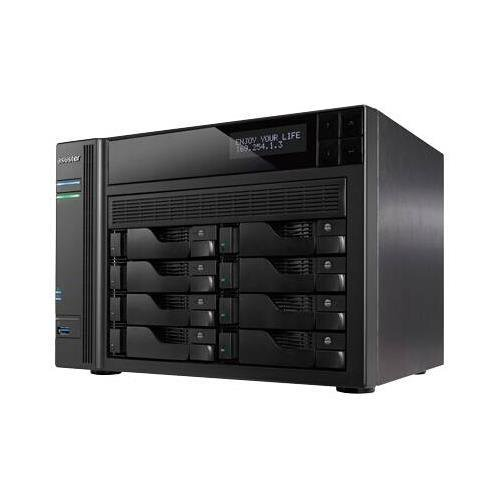](https://www.amazon.com/ASUSTOR-AS7008T-3-5GHz-2eSATA-USB3-0/dp/B00TYK14OI)

Я рассматриваю [AS7008T](https://www.asustor.com/ru/product?p_id=23), который считается сервером уровня предприятия (скорее, переходный вариант).

**Характеристики**:

- Intel i3 3.5GHz с AES-NI.
- DDR3 2 ГБ, расширяется до 16 ГБ.
- SATA-3, 8 дисков, максимум 96 ТБ (плюс, есть [устройство расширения](https://www.asustor.com/product/AS6004U), с ним 240 ТБ) с JBOD, RAID 0, RAID 1, RAID 5, RAID 6, RAID 10. Горячая замена.
- Дисковое шифрование AES-256.
- Внутренняя ФС - ext4.
- Поддерживаются FAT32, NTFS, EXT3, EXT4 и HFS+.
- Ethernet 1 Гб/с x 2, возможно подключить карту на 10 Гб/с через PCI Express.
- Слот PCI Express.
- USB 3.
- ОС - модифицированный Linux.
- Максимальная мощность 250 Вт.

**Предоставляет:**

- Резервное копирование в облако. Поддерживается MS OneDrive, HiDrive, Dropbox, Google Drive, hubiC, Yandex Disk.
- Резервное копирование посредством Rsync (сервер Rsync).
- Резервное копирование одним касанием.
- Поддержку виртуализации с VmWare и Citrix.
- Поддержку VirtualBox (на нём из коробки возможно запускать ВМ).
- Управление фотогалереей.
- Управление музыкальной коллекцией (SoundsGood).
- Медиасервер с DLNA.

**Особенности:**

- Есть ИК приёмник.
- Ж/к экран.
-  S/PDIF выход.
- Шумноват:  27.6 Дб с остановленными дисками.
- Поддерживает iSCSI.
- Настраиваемые страницы входа в систему.
- Есть поддержка iTunes-сервера.
- Предоставляет почтовый сервер.
- VPN сервер и VPN клиент.

Часть NAS Asustor делается на Celeron, часть на Core.
За Core i3 с 2-4 Гб non-ECC RAM цена весьма немаленькая.
Диски, из того, что я посмотрел, были только SATA.

В качестве ОС там используется [несколько модифицированный Linux](https://www.asustor.com/adm/adm2_6), пусть и не самый свежий, но вполне себе пригодный к использованию.
Возможно [установить свой Linux отдельно и пробрасывать GUI по сети](https://www.asustor.com/admv2?type=3&subject=17&sub=134).
Диски шифруются, AES-256, всё серьёзно.
GUI, как и полагается, ориентирован на пользователя и представляет собой модный ныне "набор значков на рабочем столе", похожий на QNAP.
В NAS уже включены сервисы, типа интегрированного DLNA, установки дополнительных приложений в один клик и т.п..

NAS подходит для того, чтобы решить вышеописанные задачи: если чего-то не хватает, всегда возможно запустить это в виртуальной машине (пусть и с дополнительными расходами).

**$1300-$1600**

### [Buffalo](https://www.buffalotech.com/products/category/network-attached-storage)

[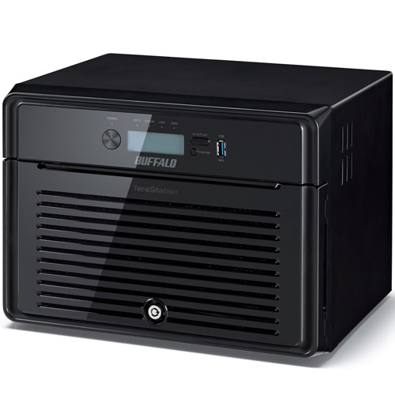](https://www.amazon.com/Buffalo-TeraStation-5810DN-Desktop-Included/dp/B071XDW5BP)

Серьёзный американский NAS от серьёзного американского производителя.
Интересующая линейка выглядит солидно и солидно же называется: [Terastation](https://www.buffalotech.com/products/terastation-5010-series-desktop).

Позиционируется больше, как "бытовое устройство для хранения и распространения данных", чем как универсальный компьютер с расширяемой ОС.

**Характеристики**:

- Annapurna Labs Alpine Processor AL314 (похожий используется в некоторых моделях QNAP), ARM.
- DDR3 с ECC, 4 ГБ.
- SATA-3, максимум 8 дисков (Pre-tested NAS grade Hard drives included with RAID pre-configured), горячая замена.
- Дисковое шифрование AES-256.
- Ethernet 1 x 10 Гб/с, 2 x 1 Гб/с.
- USB 3.
- Про ОС ничего сказать нельзя, хотя вероятно это Linux.
- Максимальная мощность 150 Вт.

**Предоставляет:**

- Персональное облако.
- Медиасервер с DLNA.
- Интеграцию с облачными хранилищами и возможность репликации в облако прямо с NAS (поддерживается Amazon S3).
- Своя система резервного копирования NovaBackup.
- Виртуализацию с Citrix или VmWare.

**Особенности:**

- Есть замок на дверцу.
- Есть встроенный антивирус от TrendMicro (вряд ли он нормально что-то ловит).
- Для управления используется программа NASNavigator2.
- Есть возможность репликации между NAS.
- При замене дисков, [придётся покупать их у Buffalo](https://www.buffalotech.com/products/replacement-hard-drives-for-terastation-5210dn-5410dn-5410rn-3010-series) (см. список поддерживаемых дисков в [спецификации](https://www.buffalotech.com/products/terastation-5010-series-desktop)).

Web GUI:

Ну, и три года гарантии, как полагается.

NAS подходит для того, чтобы решить вышеописанные задачи, но всё-таки я бы не стал его покупать: дорого, не так много возможностей даже по сравнению с Asustor, не слишком гибко.

Цена порядка **$1970**.

### [Cisco](https://www.cisco.com/c/en/us/support/storage-networking/index.html)

[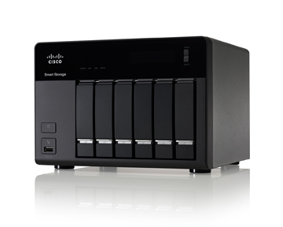](https://www.amazon.com/Cisco-Network-Attached-Storage-NSS326D00-K9/dp/B003MB62XI)

Конечно же, Cisco не мог остаться в стороне.

[Модель уже снята с производства](https://www.cisco.com/c/en/us/support/storage-networking/nss326-6-bay-smart-storage/model.html), а выпущена была аж в 2012.
Тем не менее, я не мог пропустить данную фирму.
Да и купить её агрегат, при желании, ещё возможно.

**Характеристики**:

- Процессор Intel Atom D510 1.66 GHz (Dual Core).
- DDR-2, 1 ГБ.
- До 6 SATA дисков, которые могут быть аппаратно организованы в любой из типов RAID или представлены, как JBOD.
- Дисковое шифрование по AES-256.
- Внутренняя ФС - ext4.
- 512 МБ флэш памяти.
- Ethernet 1 Гб/с x 2.
- ОС Linux, со старым даже для 2012-го, ядром 2.6.
- Максимальная мощность 250 Вт.

**Предоставляет:**

- Поддержку бэкапа с Rsync.
- Интегрированный on-line бэкап в [Mozy](https://mozy.com/).
- Медиасервер с DLNA.
- Возможность виртуализации с VmWare и Hyper-V.

**Особенности:**

- Поддерживает множество протоколов.
- Имеет возможность предоставлять iSCSI-таргеты.
- Поддерживает наблюдение за состоянием ИБП.
- Есть пользовательские квоты.
- Есть SMS-оповещения.
- Есть ограничение на количество соединений (это не касается локального подключения): 10 Web или мобильных подключений за день, не более 30 минут подключения по Web, только одно Web соединение.

Полную спецификацию возможно посмотреть [на этой странице](https://www.cisco.com/c/en/us/products/collateral/storage-networking/small-business-nss300-series-smart-storage/data_sheet_c78-599859.html).

Предоставлялась "Cisco Small Business Support Service" на три года.
Я бы не стал покупать данный NAS, не только потому, что он несколько устарел, но ещё и по причине лимитов на количество подключений: как Web-сервер без доработки его не попользуешь.
Не вполне понятно, с какими целями "эффективный менеджмент" Cisco ввёл такие ограничения.

Цена впечатляет: **$3300**

### [Drobo](http://www.drobo.com)

Drobo представляет собой персональный DAS.
На постсоветском пространстве и в Европе не популярен. Зато вполне известен в США.
Работает он только с NTFS и HFS+.

Здесь я его привёл, потому что он любопытен двумя вещами:

- Он не имеет Web интерфейса. Управление производится через приложение, которое правда, работает только на MacOS и Windows.
- Он использует свою технологию "BeyondRAID". Это RAID массив с избыточностью, но позволяющий использовать диски разных размеров. Кроме того, я так понял, что он пофайловый. Т.е. резервируются не блоки, а файлы, и при разрушении массива, всё равно возможно восстановить часть файлов с оставшихся носителей.

Если нужны подробности, смотрите [обзор 2017-го года на IXBT](https://www.ixbt.com/storage/drobo-5d.shtml).

Подходит оно для фотографов, но для моих задач не устраивает даже, как дисковая корзина.

[С 5-ю дисками на 4 ТБ](https://www.amazon.com/Drobo-5D-Attached-Thunderbolt-DRDR5A21/dp/B008MH1JRQ) стоит он порядка **$1600**.

### [FreeNAS](http://www.freenas.org/freenas-mini/)

[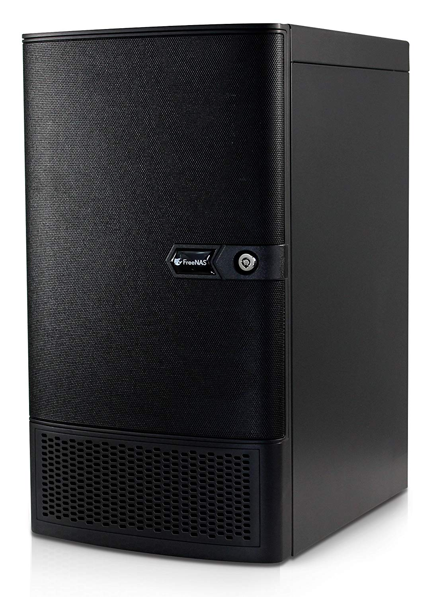](https://www.amazon.com/FreeNAS-Mini-XL-Diskless-Attached/dp/B01CKN76OW)

Это FreeNAS.

**Характеристики**:

- Intel Avoton, 8 ядер (он напаян, используется известная плата от ASRock).
- 16 ГБ DDR3 с ECC, с возможностью расширения до 32-х (ограничение платы, в новых до 64-х).
- 8 hot-swap SATA-3 дисков.
- Поддержка ZRAID.
- Всё на ZFS, включая корень.
- XTS шифрование пула по AES-256.
- Максимальная мощность 80 Вт.

**Предоставляет:**

- Во FreeNAS из коробки поддерживается контейнеризация.
- Всё остальное, что поддерживает FreeNAS.

**Особенности:**

- Есть замок.
- На корпус стоит обратить особое внимание: он действительно хорош и где-то я видел, что продаётся отдельно.

У них всё хорошо.

**ПО в пояснениях и комментариях не сильно нуждается.**
Но есть минусы, относящиеся к самому FreeNAS: установщик системы примитивный, и соответственно, стоит ожидать, что ОС в данной системе установлена на один носитель без шифрования.
Шифруется только пул.
Впрочем, ничто не мешает установить на это железо что-угодно: данная плата и остальное железо очень хорошо поддерживаются, как Linux, так и различными BSD.

**Железо тоже не особенно нуждается в комментариях.**
В качестве платы используется одна из весьма известных в кругах строителей NAS плат ASRock:
[C2550D4I](http://www.asrockrack.com/general/productdetail.asp?Model=C2550D4I#Specifications), либо [C2750D4I](http://www.asrockrack.com/general/productdetail.asp?Model=C2750D4I#Specifications).
Своего железа "от FreeNas(c)" там нет, что не может не радовать.

NAS подходит для того, чтобы решить вышеописанные задачи, скорее всего его бы я и выбрал, в случае покупки, несмотря на то, что железо меня не совсем устраивает.

Цена без дисков: **$1350-$1520**
[На 48 ТБ](https://www.amazon.com/FreeNAS-Mini-XL-48TB-Attached/dp/B00QMPM5BO): **$3500**.

### [Helwet-Packard ProLiant Microserver](https://www.hpe.com/ru/ru/product-catalog/servers/proliant-servers/pip.hpe-proliant-microserver-gen10-x3216-8gb-u-4lff-nhp-sata-200w-ps-entry-server.1009955178.html)

Строго говоря, NAS не является, но может выполнять его функции.
Я не особенно жалую продукцию HP, но его попросили включить в обзор.

[Обзор на IXBT (от 2017-го года)](https://www.ixbt.com/comm/hp-proliant-microserver-gen10-review.html).

Это уже 10-е поколение Microserver.
[8-е поколение было с сокетом LGA1155, и поддерживало от Celeron в более дешевых конфигурациях до Xeon в дорогих, что позволяло достаточно дешево обновлять конфигурацию на более мощную](https://www.amazon.com/HP-783959-S01-ProLiant-Server-E3-1220LV2/dp/B00N55ADEA), и стоило дороже, а теперь они зачем-то делают сервера на AMD.

**Характеристики:**

- AMD Opteron X3421 Processor (2.1-3.4GHz, 4 вычислительных ядра, 8 графических).
- DDR4 с ECC, 8 ГБ с возможностью расширения до 32 ГБ.
- SATA-3, 4 диска, **без горячей замены**, [RAID контроллер](https://h20195.www2.hpe.com/v2/Getdocument.aspx?docname=a00017196ENW)
- Ethernet 1 Гб/с x 2. Контроллер от Broadcom.
- Слот PCI Express x4.
- Слот PCI Express x8.
- USB 3 x 2.
- ОС - [ClearOS](https://www.clearos.com/) на базе Linux, но возможно установить, как Windows, так и RHEL.
- Максимальная мощность - 200 Вт.

**Предоставляет:**

- Поддержку резервного копирования через BackupPC и Rsync.
- Виртуализацию "из коробки".
- Персональное облако.
- Синхронизацию с облаком: Dropbox.
- Поддержку бэкапов в облако через Remote Data Backup.

**Особенности:**

- Есть два Display port.
- Есть защита от malware и вирусов.
- IDS/IPS.
- OpenVPN.
- Платная подписка на некоторые приложения.

С полным списком приложений возможно ознакомиться [на сайте ClearOS](https://www.clearos.com/products/clearos-editions/clearos-7-business/marketplace/)

Web-интерфейс:

Сервер на процессоре AMD и с сетевыми контроллерами Broadcom для меня однозначно - не вариант.

Цена: **$580**

### [Iomega/Lenovo](http://lenovoemc.com/)

[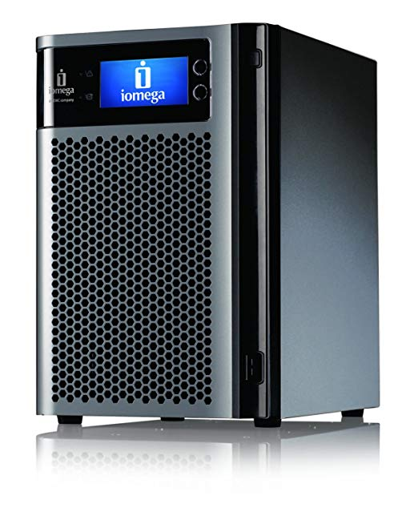](https://www.amazon.com/Iomega-StorCenter-PX6-300d-diskless-34769/dp/B004Z02XW4)

[Тут](https://www.cnet.com/products/iomega-storcenter-px6-300d-network-storage-nas-server-18-tb-series/specs/) возможно посмотреть спецификацию.

Когда-то, когда в ходу ещё были дискеты, я поражался огромной ёмкостью [Iomega Zip](https://ru.wikipedia.org/wiki/Iomega_Zip) в 100 МБ и больше (тогда ещё HDD были сотни мегабайт и гигабайты).
И NAS от той же компании, пусть это и старое решение, которое снято с производства, вызвал ностальгию.
Однако, компания же давно куплена китайцами в лице Lenovo.
И NAS они более не производят.

[Поддержка окончилась в 2017](http://lifelineapps.com/).
[Обзор 2012-го года](https://fcenter.ru/online/hardarticles/hdd/32704-Setevoj_nakopitel_Iomega_StorCenter_px6_300d)

**Характеристики**:

- Intel Atom D525 (2 ядра, 4 потока, 1,8 ГГц)
- DDR2 2 ГБ, возможно расширить, установив второй модуль.
- 6 x SATA-3 дисков, RAID 0, 1, 10, 5, 6 и JBOD, горячая замена.
- Внутренняя ФС - XFS.
- Ethernet 1 Гб/с x 2 (но контроллеры Realtek RTL8111E, не лучшие).
- USB 3.0 один разъём.
- PCIe 4x.
- ОС установлена на USB flash Samsung объемом 1 ГБ.
- ОС - Iomega Storage Manager на базе Linux.

**Предоставляет:**

- Бэкап через Rsync.
- Поддержку Amazon S3 и Mozy.
- Personal Cloud, но своё облако нужно регистрировать на серверах Iomega, так что вероятно, это уже не работает.
- Поддержку репликации между NAS.
- Медиасервер с DLNA.

**Особенности:**

- SMB отключить его нельзя.
- Поддержка технологии Windows DFS для объединения нескольких внешних сетевых ресурсов в одной общей папке в px6-300d.
- Поддерживает iSCSI.
- Поддержка резервного копирования Time Machine.
- Вентиляторы с PWM.

WEB интерфейс симпатичный:
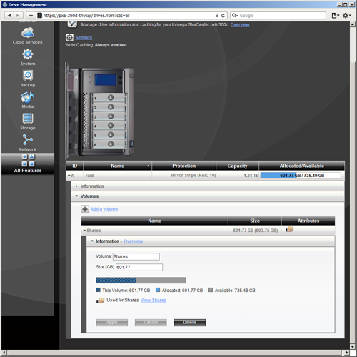

Когда-то была неплохая система. Сейчас в обзоре этот NAS лишь для истории.
Хотя, даже с ним возможно решить мои задачи.

Б/у стоит порядка **$980.00** (при изначальной цене $2000+).

### [Netberg](http://netberg.ru/products/)

[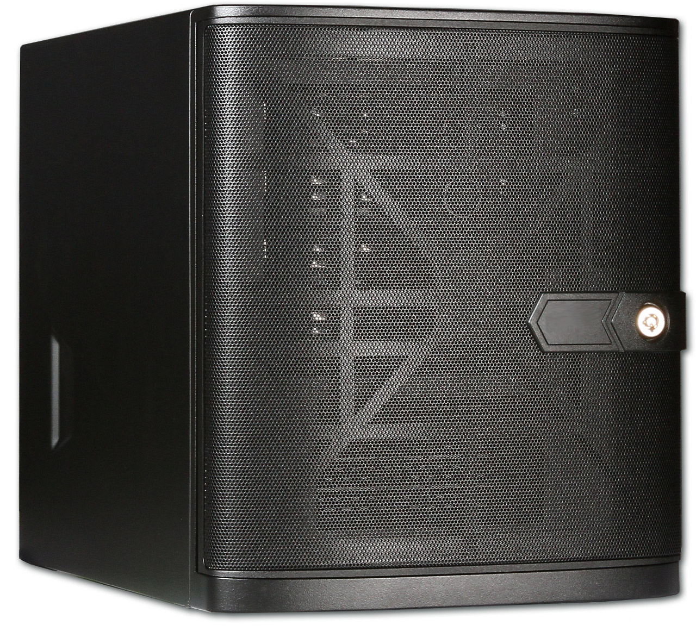](http://netberg.ru/products/demos-p200-m2/)

Весьма своеобразное решение, которое позиционируется не как NAS, а как сервер для малого офиса.
Они делают его под ключ, так что даже сломанные диски заменят, если что, но самостоятельно лезть руками нельзя, даже чтобы заменить диск: сразу аннулируется гарантия.
Уровень сервиса у них не очень: я связался с ними, мне ответили, но потом всё надолго затихло.
Через неделю или две тот же менеджер мне написал, что у них была реорганизация.

**Характеристики**:

- Intel Xeon E5-2603 v3 6C/6T, 1.6GHz (15MB кэш, 6.4GT/s). В базовой комплектации указан E-3.
- 8GB DDR3 ECC+REG, возможно расширить до 16 ГБ (цена указана с 8-ю).
- SATA-3 4 ТБ x 2.
- Ethernet 1 Гб/с x 2. Intel.
- Слот PCI Express 3.
- Стоит ли что-то в качестве ОС неясно: меня интересовало железо.
- Максимальная мощность 250 Вт.

**Особенности:**

- Есть IPMI 2.0.
- KVM over IP с выделенным Ethernet портом.

Вообще, неплохое железо, по достаточно приемлемой цене.
Хорошо совместимо с Linux и BSD.
Если бы не особенности общения с клиентами, я бы задумался над его приобретением.

Цена: **$1372**

### [Netgear](https://www.netgear.ru/business/products/storage/readynas/readynas-desktop.aspx#tab-%D0%BC%D0%BE%D0%B4%D0%B5%D0%BB%D0%B8)

**Характеристики:**

- Intel D-1508 2,2 ГГц.
- 8 дисков, максимум поддерживается 130 ТБ, RAID.
- DDR4 4 ГБ с ECC.
- 2 x 10 ГБит Ethernet.
- Есть iSCSI, DLNA.
- ОС - ReadyNAS OS 6.9.
- Максимальная мощность 250 Вт.

**Предоставляет:**

- Поддержку Amazon Cloud Drive, Dropbox, Google Диск, OneDrive и Azure.
- Проприетарное облачное хранилище ReadyCLOUD.
- Поддержку виртуализации на базе VmWare.

Вроде как, неплохой NAS, но дальше я не интересовался: если у кого-то есть личные впечатления, допишу сюда.
Мои задачи с помощью этого вполне возможно решить.
Цена, правда, немалая.

[Цена порядка](https://www.amazon.com/NETGEAR-ReadyNAS-Performance-Attached-RN528X00-100NES/dp/B01NAL50M3): **$1600** без дисков.

### [Promise technology](https://www.promise.com/Products/Pegasus/Pegasus2/R8)

[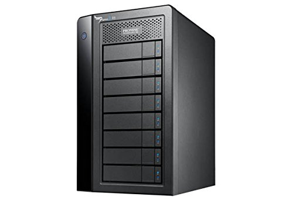](https://www.amazon.com/dp/B00NFYJ83S)

Это DAS, но прежде чем я понял это (смотрел на цену), пришлось лезть в его мануал.

**Характеристики:**

- Процессор PMC Sierra 8067.
- 1 ГБ DDR3-1866 SDRAM.
- 8 SATA дисков, максимум 48 ТБ, RAID 0, 1, 5, 6, 10, 50, 60.
- Максимум 250 Вт.

**Предоставляет:**

- ПО ChronoSync Pegasus Edition для резервного копирования.

**Особенности:**

- Поддержка Thunderbolt 3.

На сайте Promise Technology много рекламных материалов, среди которых нет даже нормальных характеристик железа. Видимо, их менеджер по рекламе посчитал, что знать характеристики процессора для пользователей - лишнее.
Пришлось искать.

В качестве дисковой корзины этот DAS вполне себе может подойти: на его основе возможно строить NAS (хотя и дорого).

Цена: **$3400-$4500**

### [QNAP](https://qnap.ru/catalog/nas)

[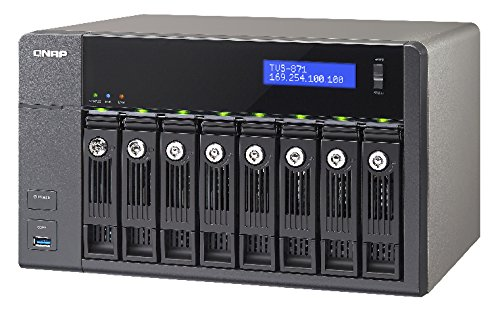](https://www.amazon.com/QNAP-TVS-871-i7-16G-US-8-Bay-3-2GHz-10G-ready/dp/B00S0XRY7Q)

О QNAP написано и так много.

Компактный корпус на 8 дисков, каждый из которых легко достать.
Над каждым диском индикатор.
Это их "фирменный стиль".
У QNAP, наверное, самая широкая линейка NAS среди всех производителей, под большое количество рыночных сегментов, линейка CPU, соответственно также широкая: Atom, Core i3-i7, Xeon (обычно в стоечных моделях), даже [AMD Ryzen с конца 2017-го](https://www.qnap.com/en/news/2017/world-s-first-ryzen-nas-qnap-ships-ts-x77-business-nas-powered-by-8-core-3-7-ghz-amd-ryzen-7-1700-processor-for-boosted-virtual-machine-performance).

Изо всех моделей я рассматриваю [TVS-871-i7-16G](https://qnap.ru/tvs-871).
Это модель 2015-го года, но сейчас она подойдёт для большинства применений.
[По ней есть обзор на PCGamer](https://www.pcgamer.com/qnap-tvs-871-nas-review/).

[Для разнообразия - обзор персонального NAS на IXBT (за 2017-й)](https://www.ixbt.com/storage/qnap-d2-d4.shtml)

**Характеристики:**

- Intel Core i7-4790S 3,2 ГГц, 4 ядра.
- DDR3, 16 ГБ.
- SATA-3, 8 дисков, 96 ТБ максимум (576 ТБ с модулями расширения, например [UX-800P](https://www.qnap.com/en/product/ux-800p) или [UX-500P](https://www.qnap.com/en/product/ux-500p)), RAID 0/1/5/6/10, RAID 5/6/10, однодисковый том + резервный диск, горячая замена.
- Дисковое шифрование AES-256.
- 512 МБ флэш памяти.
- Внутренняя ФС - ext4.
- Ethernet 1 Гб/с x 4.
- PCIe x8 x 2.
- Аппаратное шифрование.
- USB 3.0 x 3.
- ОС - доработанный Linux, называемый QTS.
- Максимальная мощность 350 Вт.

**Предоставляет:**

- Сервер удаленной репликации (на основе Rsync).
- Поддержку бэкапа от сторонних производителей: Veeam Backup & Replication, Acronis True Image, ARCserve Backup, EMC Retrospect, Symantec Backup Exec, LaCie SilverKeeper и т.д.
- Виртуализацию на базе KVM и позволяет установить, например, [произвольный Linux не ломая прошивки NAS](https://www.qnap.com/solution/linux-station/en/index.php).
- Поддержку виртуализации с VmWare, Citrix, etc..
- Контейнеризацию из коробки.
- VJBOD, позволяющий объединить несколько QNAP NAS.
- Сервер и клиент LDAP, также есть RADIUS сервер.
- Синхронизацию с облачными хранилищами: Amazon S3, ElephantDrive, Symform, Dropbox и Google Drive.
- Персональное облако через myQNAPcloud.
- Простую синхронизацию между несколькими устройствами, в т.ч. мобильными.
- Медиасервер с DLNA, для чего надо отдельно установить приложение (в два клика).

**Особенности:**

- Модули расширения возможно подключать по SAS.
- На каждый диск есть отдельный замок.
- Система полнотекстового поиска Qsirch.
- Есть множество приложений, адаптированных для QNAP.
- Предоставляет iSCSI.
- Есть бондинг портов (режимы: Balance-RR, Active Backup, Balance XOR, Broadcast, IEEE 802.3ad/Link Aggregation, Balance-TLB и Balance-ALB).
- Поддержка DDNS.
- Возможна привязка услуг к указанным сетевым интерфейсам.
- Поддержка Apple Time Machine.
- Встроенный антивирус.
- Web GUI системы тоже очень проработан и удобен. Такие ошибки, как в OMV, тут пользователю даже в страшном сне не приснятся.
- Из коробки организуется станция видеонаблюдения на 72 канала максимум.
- Есть HDMI выход.

Картинка с внутренним устройством QNAP "с высоты птичьего полёта":

Очень неплохой NAS по средней цене. Если же что-то не устраивает, есть модели "чуть ниже" и "чуть выше".
Конечно же с использованием данной системы я могу решить все вышеуказанные задачи.

Цена: **$2000-2500**

### [QSAN](http://www.qsan.su/goods/nas-serveryi/)

**Характеристики:**

- Процессор Intel Celeron 2.9 GHz Dual-Core.
- RAM 8GB DDR4 SO-DIMM с ECC, расширяется до 32GB.
- 8 дисков SATA 6Gb/s (максимальная сырая емкость 82TB), RAID 0, 1, 5, 6, 10, 50, 60 и JBOD.
- SSD кэш на чтение и запись.
- Flash 8GB USB DOM (видимо, сюда установлена ОС).
- Дисковое шифрование AES-256, сертификация FIPS 140-2.
- Внутренняя ФС - ZFS.
- Ethernet 1 Gb x 4
- Есть слот PCIe Gen3x8 для карт расширения 10/40 GbE / Thunderbolt 3.0/SAS.
- USB 3.0 x 5.
- ОС - QSM 3.0 (QSAN Storage Management 3.0) на основе Linux.

**Предоставляет:**

- Копирование в облако Amazon S3.
- Синхронизация с облаком Google Drive, Windows OneDrive и Dropbox.
- Бэкап через Rsync (работает, как rsync сервер).
- Поддержку стороннего ПО резервного копирования: Acronis True Image, CA Brightstor ARCserve Backup, EMC Retrospect, Symantec Backup Exec, LaCie Silverkeeper, Snapshot replica, Time machine backup server.
- Поддержку виртуальных машин (в том числе резервное копирование и снэпшоты). Пишут, что данный NAS сертифицирован по VMware Ready, Citrix Ready и Microsoft Hyper-V. Т.е. виртуализация и работа с известными гипервизорами поддерживается "из коробки".
- Media библиотеку.
- Медиасервер с DLNA.

**Особенности:**

- Отличный корпус и хорошая идея для смены дисков. Редкий случай, когда я вспоминаю про "дизайн". Просто он классно смотрится.
- Широкий набор возможностей на все случаи жизни.
- Поддерживает Thunderbolt.
- Есть открытие ISO образов.
- Возможность автоматической публикации в facebook, twitter, weibo.
- Есть мобильное приложение для доступа к облаку.
- Встроенный антивирус.
- Есть "технология многоуровневого хранения". Наиболее часто запрашиваемые данные перемещаются на самый скоростной уровень, наименее востребованные, переносятся на медленный уровень.
- Синхронизация данных между несколькими NAS: XMirror.
- Поддержка дисков SED (это те, которые самошифрующиеся, и это в дополнение к AES шифрованию). Если владельцу необходимо перенести такие диски с данными в другой XCubeNAS, поддерживается экспорт ключа аутентификации.

Они используют ZFS, которую они почему-то называют "собственной отлаженной" (по-моему, QSAN - не Sun, хотя и похоже по звучанию, но ZFS они не разрабатывали).

XMirror поддерживает однонаправленное зеркалирование: данные, измененные на локальном NAS, будут изменены на удаленном NAS, но любые изменения данных на удаленном NAS будут проигнорированы.
И двунаправленное зеркалирование: при любых изменениях данных на любом из NAS данные будут изменены и на другом NAS.
Файлы версионируются (до 64-х версий).
Возможно организовать геораспределённое хранилище.

Web GUI чем-то напоминает QNAP:
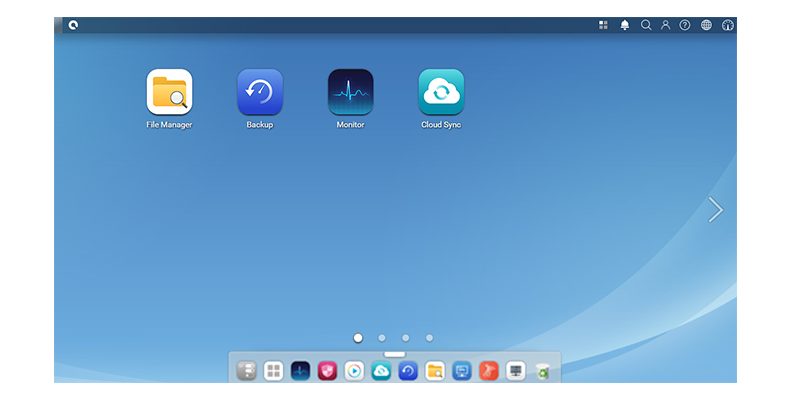

Я написал письмо на info@qsan.ru, где попросил указать цену.
На письмо мне не ответили, но производитель отписал о цене в комментариях к данной статье.
Есть нарекание к процессору: всё-таки двухядерный Celeron не самое лучшее решение.

Купить данный NAS возможно связавшись с QSan: в магазинах пока что его ещё не найти.
Рекомендуемая производителем розничная цена: **$3000**.

### [Sans Digital](http://www.sansdigital.com/12-bay-enclosures.html)

Данные системы не являются NAS - это корзины-расширители, вмещающие несколько дисков.
Они интересны прежде всего тем, что они единственные изо всех приведённых поддерживают не только SATA, но и SAS.
Приведу здесь две разные модели: башню и "лежачий" корпус.

[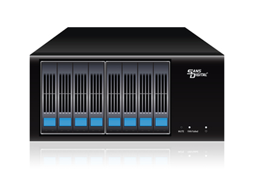](https://www.amazon.com/Sans-Digital-MobileSTOR-MS28X6G-mini-SAS/dp/B00X7ZCSKU)
[На сайте производителя](http://www.sansdigital.com/ms28x6g.html)

**Характеристики:**

- 8 SAS/SATA дисков на 2.5", JBOD, максимум 16TB.
- Максимальное потребление 300 Вт.

**$500**

**Характеристики:**

- 12 SAS (12 Гб/с) или SATA (6 Гб/с) дисков 3.5" с горячей заменой (поддерживается максимум - 120 ТБ), JBOD, или опциональный RAID контроллер.
- Максимальное потребление 300 Вт.
- Есть также модель на 8 дисков.

Быстрое подключение по SAS, цена средняя. Вполне приемлемое решение, как для расширения NAS, так и для построения хранилища на их основе.

[На сайте производителя](http://www.sansdigital.com/ms8x6plusb.html)
Цена: **$1100**

### [Synology](http://www.synology.su/products/115)

О Synology написано также много, как и о QNAP, и не имеет смысла повторяться.
Поэтому, очень кратко:

- У них есть множество решений, ориентированных на разные рыночные сегменты.
- Потому, линейка используемых CPU очень широка: [от Atom до Xeon](https://www.synology.com/en-global/knowledgebase/DSM/tutorial/General/What_kind_of_CPU_does_my_NAS_have).
- На данных NAS своя ОС на базе Linux.

#### [DS3617xs на 12 дисков](https://www.synology.com/ru-ru/products/DS3617xs)

Это мощный сервер, для которого заявлено, что он поддерживает до 4000 пользователей.

**Характеристики:**

- Intel Xeon D-1527, 2.2-2.7 ГГц, 4 ядра.
- DDR4 ECC SO-DIMM 16 ГБ, с возможностью расширения до 48 ГБ.
- SATA-3, 12 дисков 3.5"/2.5" (до 36 с устройством расширения)  с горячей заменой, максимум 144 ТБ (432 с устройством расширения), Synology Hybrid RAID, Basic (видимо, имеется ввиду однодисковая конфигурация), JBOD, RAID 0, RAID 1, RAID 5, RAID 6, RAID 10.
- Дисковое шифрование по AES-256.
- ФС Btrfs или ext4.
- Ethernet 1 Гб/с x 4.
- Слот PCI Express x8 x 1.
- USB 3 x 2.
- ОС - [Synology Disk Station Manager (DSM)](https://xpenology.com/forum/), открытый и основанный на Linux.
- Максимальная мощность 500 Вт.

**Предоставляет:**

- [Большое количество пакетов, включая Gitlab](https://www.synology.com/ru-ru/dsm/packages).
- Резервное копирование с репликацией в облако через [HyperBackup](https://www.synology.com/ru-ru/dsm/feature/hyper_backup).
- Виртуализацию: VmWare, Citrix, даже поддержка OpenStack.
- Персональное облако через "Cloud Station Server".
- Медиасервер с DLNA.
- [Фото галерея Synology Moments](https://www.synology.com/en-global/dsm/feature/moments) с распознаванием лиц.
- Синхронизацию между NAS.
- [Объединение NAS в кластера высокой доступности (активный-пассивный с горячим резервированием)](https://www.youtube.com/watch?v=Wrl3j10bj7Y).
- Возможность централизованного управления несколькими NAS.
- Простой обмен файлами между пользователями через Drag&Drop (File Station).

**Особенности:**

- Три скорости вентилятора: максимальная, охлаждение, тихий.
- Предоставляет iSCSI.
- Есть проверка подлинности через Kerberos.
- Антивирус от McAffee, правда Trial.
- Из коробки поддерживается чат.
- Есть Web-офис, в котом возможно организовать совместную работу.
- Предоставляет VPN-сервер.
- Почтовый сервер.
- Может работать, как "станция слежения": возможно подключить до 40 IP-камер.
- Поддерживает максимум 8 виртуальных машин.
- Поддерживает технологию [PetaSpace](https://www.synology.com/en-global/knowledgebase/DSM/help/PetaSpace/PetaSpace_desc).
- Возможна двухфакторная авторизация.
- Есть замок на корзину.

Цена без дисков: **$2500-$3100**.

#### [DS1817 на 8 дисков](https://www.synology.com/ru-ru/products/DS1817+)

[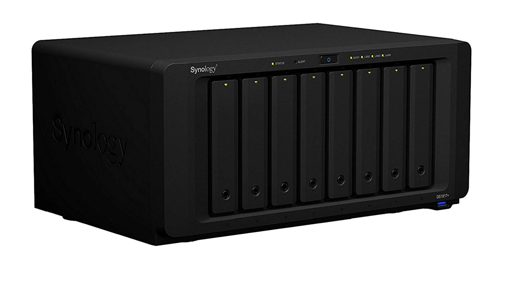](https://www.amazon.com/Synology-Station-Network-Attached-DS2415/dp/B06Y4TJL54)

**Характеристики:**

- Intel Atom C2538, 2.4 GHz, 4 ядра.
- DDR3 2 ГБ с возможностью расширения до 16 ГБ.
- SATA-3, 8 дисков 3.5"/2.5" (до 18 с устройством расширения) с горячей заменой, максимум 96 ТБ (216 с устройством расширения), Synology Hybrid RAID, Basic, JBOD, RAID 0, RAID 1, RAID 5, RAID 6, RAID 10.
- ФС Btrfs или ext4.
- Ethernet 1 Гб/с x 4.
- Слот PCI Express x8 x 1.
- USB 3 x 4.
- Максимальная мощность 250 Вт.

Максимальное количество виртуальных машин тут 4.
И по характеристикам эта модель ближе к NAS, тогда как предыдущая ближе к серверу.
В остальном, всё тоже.
[Также, есть похожее решение на 12 дисков](https://www.synology.com/ru-ru/products/DS2415+), но с меньшим количеством RAM (2GB, расширить возможно только до 6GB).

Цена без дисков: **$950**

#### Вывод

Хорошие NAS. Качественный корпус, большое количество сервисов, открытая ОС и множество доступных приложений.
Несколько претит идея ограничивать лицензией количество подключений к VPN серверу и количество виртуальных машин.
Но, в целом, вариант на Xeon вполне подошёл бы для решения моих задач без особых сложностей в настройке, даже без наличия серьёзных технических знаний.
Стоит признать, что разработчики действительно сделали продукт грамотно, а также его верно позиционируют.

### [Thecus](http://www.thecus.com/product_catalog.php?PROD_TYPE_ID=1)

[На сайте производителя](http://russian.thecus.com/product.php?PROD_ID=72)
[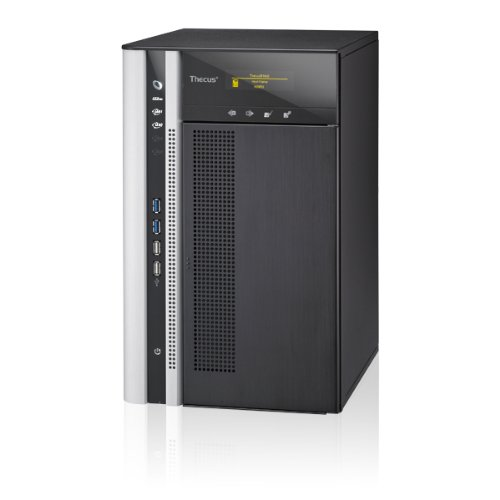](https://www.amazon.com/Thecus-TopTower-N8850-Server-Enterprise/dp/B0085RURUI)

**Характеристики:**

- Intel Core i3 2120 (3.3GHz Dual Core)
- DDR3 4GB с возможностью увеличения до 32GB.
- SATA III, 8 жёстких дисков, RAID 0, 1, 5, 6, 10, 50, 60 и JBOD.
- Дисковое шифрование AES-256.
- Из ФС поддерживаются EXT*, XFS, BtrFS.
- Ethernet 1 Гб/c x 2.
- Ethernet 10 Гб/с (возможно 2 штуки).
- Два 8-полосных разъема PCI Express.
- USB 3.
- ОС - [ThecusOS](http://www.thecus.com/ThecusOS7/), на основе Linux (графика обеспечивается через X).
- Максимальная мощность 400 Вт.

**Предоставляет:**

- Rsync сервер.
- Резервное копирование утилитами от Thecus и от Acronis.
- Поддержку DropBox, ElephantDriver, Amazon S3.
- LDAP.
- Синхронизацию между NAS.
- Возможность объединения NAS в кластер.
- Медиасервер с DLNA.
- Фото сервер "Piczza!".

**Особенности:**

- Приятная особенность: сенсорный экран.
- Поддерживает объединение каналов (Load balance, Failover, 802.3ad, Balance-XOR, Balance-TLB, Balance-ALB).
- [Много приложений](http://www.thecus.com/sp_app_center.php).
- Возможность установить модуль с антивирусом.
- Возможность создания и записи ISO.
- Поддержка iSCSI.
- Возможно использовать, как сервер видеонаблюдения и подключить до 10 IP-камер.
- Есть графика через выход HDMI.

Обобщающая картинка с их сайта:
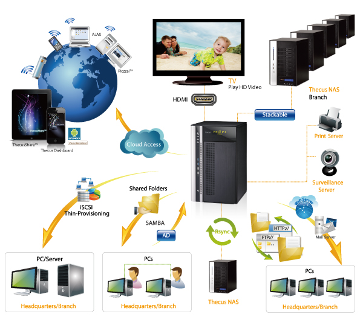

Типичный NAS, не очень дорогой, средне производительный. Сенсорный экран - интересное решение. Про виртуализацию и контейнеризацию ничего не написано, но с учётом того, что ОС на основе Linux, с Docker или KVM проблем возникнуть не должно, а железо вполне себе поддержит несколько виртуальных машин.
Возможно брать, если нравится, мои задачи он вполне решает.

Цена: **$1700**

### [Western Digital](https://www.wdc.com/ru-ru/solutions/what-is-network-attached-storage-nas.html)

[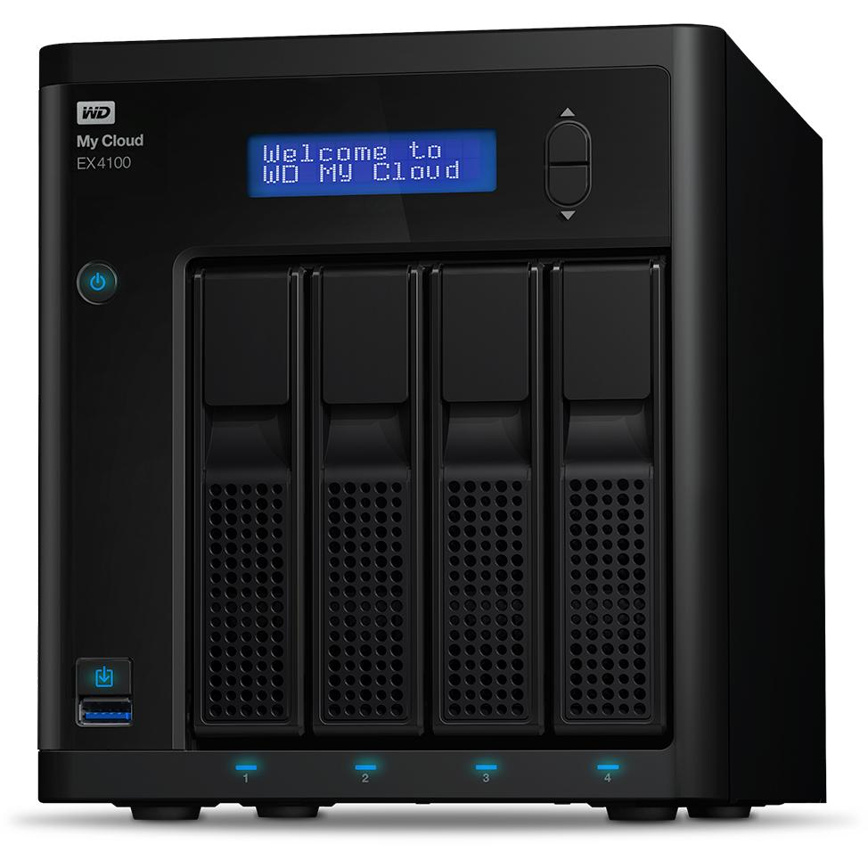](https://www.wdc.com/ru-ru/products/network-attached-storage/my-cloud-expert-series-ex4100.html)

Конечно, Western Digital тоже не мог остаться в стороне от систем хранения данных.

**Характеристики:**

- Marvell ARMADA 388, 1,6 ГГц. ARMv7, 2 ядра.
- DDR3 2 ГБ.
- Максимум 4 диска, RAID 0, 1, 5, 10 или JBOD.
- Ethernet 1 Гб/с x 2.
- ОС - WD My Cloud OS 3.

**Предоставляет:**

- Резервное копирование.
- Поддержку DLNA через "Twonky DLNA".
- Поддержку облачных Dropbox, OneDrive и Google Drive.

Позиционирование достаточно странное: исключительно домашний сегмент (и даже их NAS верхнего уровня явно не дотягивают), при этом - дорого.
И смотреть тут особо нечего, я привожу их NAS только разве для порядка.

[С дисками на 32 ТБ](https://www.amazon.com/dp/B01IW3K1ZK/ref=twister_B073SC81R3) цена порядка: **$1450**

### [Zyxel](https://www.zyxel.com/ru/ru/products_services/home-personal_cloud_storage.shtml)

[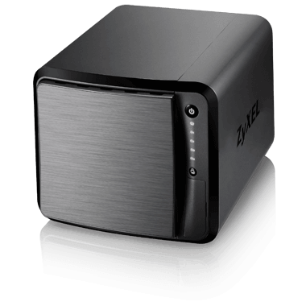](https://www.zyxel.com/ru/ru/products_services/nas540.shtml)

[Zyxel тоже отметился](https://www.amazon.com/ZyXEL-Personal-AndroidRemote-Streaming-Enterprise/dp/B073C8GN6T).

**Характеристики:**

- FreeScale Dual Core Cortex-A9 1.2 GHz.
- DDR3 1 ГБ.
- SATA II, 4 диска до 48 ТБ (2.5" или 3.5"), JBOD, RAID 0/1/5/6/10, RAID 5+ с горячей заменой.
- На дисках ext4.
- Ethernet 2 Гб/с x 2.
- Максимальная мощность 36.5 Вт.

**Предоставляет:**

- Возможность резервного копирования.
- Поддержку Google Drive, Dropbox, Memopal, ownCloud, SynBackupfree, NetDrive и свой myZyxelCloud.
- Создание своего облака, используя Zyxel Drive, zCloud или ownCloud.
- Репликацию между NAS (по шифрованному каналу, всё как полагается).
- DLNA через Twonky media server с DLNA 1.5.
- Поддержку iSCSI.
- Поддержку фото-альбомов (галерею).

**Особенности:**

- Есть SDXC кард-ридер.
- iTunes-сервер.
- Есть клиент и сервер RSS.
- Поддерживает Apple Time Machine.
- Автозагрузка фоточек и видео на YouTube/Flickr/FTP server.
- Возможно хостить свой сайт: встроен WordPress.
- Есть предупреждение при превышении температуры (я так понял, звуковое).

[Обзор](https://mysku.ru/blog/europe-stores/31421.html)

Решение не вполне подходящее под мои требования, однако как недорогой персональный NAS очень даже сгодится.

Цена: **$650**.

</spoiler>

## Выводы

Исходя из данного обзора, возможно видеть, что рынок сейчас достаточно насыщен.
Разными производителями представлены линейки систем, позволяющих решать почти любую задачу.
Покрыт, как сегмент индивидуальных пользователей, так и крупных предприятий (сегмент дата-центров, естественно покрыт давным давно, но по условиям задачи я его не рассматривал), при этом почти каждый производитель предоставляет целый набор моделей для взыскательного пользователя (у них они позиционируются, как модели для малых и средних предприятий), которые меня интересуют.

Производитель позаботился за вас о:

- Интеграции железа и ПО. Вам не нужно настраивать софт так, чтобы он понимал железо, на котором работает. Всё уже сделано, все драйвера есть, всё работает "из коробки".
- Отладке ПО. Вам не придётся находить баги, их отлаживать и самостоятельно публиковать патчи.
- Необходимом наборе ПО. Производители предоставляют множество самописных, либо адаптированных приложений, которые удовлетворят запрос абсолютного большинства пользователей.
- Дополнительных сервисах. Системы уже включают интеграцию с широко распространёнными облачными хранилищами. Часть производителей предоставляют свои private clouds. Есть репликация между NAS.
- Исправлению поломок и замене неисправного оборудования. Вам предоставляется гарантия. Даже на диски.

Отсюда вполне однозначный вывод: **почти всегда лучше купить NAS, чем делать свой**.

## Сборка своего NAS

### Зачем ты это сделал?

Я руководствовался не только ценой железки и быстрым решением задач:

- Мне просто хотелось собрать систему самостоятельно.
- В процессе я глубже разобрался с некоторыми технологиями (LDAP и контейнеризация в их числе), что тоже планировалось.
- Я хотел "более серверное" решение на базе SAS: на рынке таких я не нашёл.
- Хотелось сделать всё "под себя", чего готовые решения не предоставляют.
- Я набрал достаточно качественные компоненты, а то что предоставляют производители, ещё не факт, что самое лучшее.

### Программное обеспечение

Требования:

- Поддержка ZFS, на основе которой реализуется надёжное хранилище.
- Возможность организации слоя прозрачного полнодискового шифрования.

#### Операционная система

В связи с тем, что существует большое количество качественных свободных ОС,
ориентированных на работу с NAS, коммерческие решения не рассматриваются.
По этой же причине не рассматриваются универсальные ОС.

<spoiler title="Список ОС">
- [FreeNAS](http://www.freenas.org)
  Наиболее распространённая ОС на базе FreeBSD. Удобный, современный и проработанный Web-интерфейс.
  Большое количество функций. Широко используется в коммерческих NAS.
  ZFS в поставке.
- [OpenMediaVault](http://www.openmediavault.org/)
  Вторая по распространённости ОС для NAS. Основана на Debian Linux.
  ZFS требуется устанавливать отдельно, есть плагин.
- [Nas4Free](http://www.nas4free.org)
  Форк FreeNAS.
  ZFS в поставке.
- [OpenFiler](http://www.openfiler.com/)
  ZFS в поставке нет. Видимо, проект не развивается: последняя версия была в 2011 году.
- [XPEnology](http://xpenology.me/introduction/)
  Synology DSM. Используется в коммерческих NAS от Synology.
  Простой Windows-подобный Web-интерфейс.
  Имеет большое количество подготовленных для NAS пакетов.
- [Amahi](https://www.amahi.org/)
  ZFS в поставке.
- [Rockstor](http://rockstor.com/)
  Основан на CentOS. Интерфейс современный и удобный.
- [Nexenta CE](https://nexenta.com/products/downloads/download-community-edition/)
  ZFS в поставке.
  Свободная версия может поддерживать хранилища объёмом до 18ТБ, что неприемлемо.
- [CryptoNAS](http://cryptonas.senselab.org/)
  Система недостаточно проработана.
  Нет русскоязычного интерфейса.
</spoiler>

В качестве управляющей ОС используется OMV.

Хотя ZFS в Linux недостаточно стабилен в настоящий момент (например, имеется баг с очисткой кэшэй), Linux более гибок, и его проще настроить под требуемые задачи.
Установщик FreeNAS не поддерживает даже пользовательское разбиение дисков.
Причём, если эта проблема решаема, проблема с шифрованным корнем не решается простыми средствами во FreeNAS, а в OMV такой вариант
установки поддерживается инсталлятором.
Выбран OpenMediaVault.

### Корпус

Большинство корпусов рассчитано на 4-6 дисков. Корпусов на 8 дисков не так много.
По крайней мере, на AliExpress были найдены корпуса только для 6 дисков.
Цена доставки равна примерно половине стоимости корпуса.
Кроме того, корпус не является основной статьёй расходов.
Потому, имеет смысл брать корпус более высокого качества.

По результатам исследования были выбраны корпуса [SilverStone Case Storage DS380](http://www.silverstonetek.com/product.php?pid=452)
и [SilverStone Case Storage CS280](http://www.silverstonetek.com/product.php?pid=668).

Плюсы:

- Дверца с замком.
- 8 дисков горячей замены 3.5"/2.5".
- Поддержка до 12 дисков.
- Противопылевые фильтры на магнитных защёлках.
- Поддержка блоков питания SFX.

Silverstone DS380 выбран, как наиболее универсальный.
Подобрать диски с требуемыми характеристиками на 2.5" крайне сложно.

Альтернативные варианты:

- [Norco ITX-S8](http://www.norcotek.com/product/itx-s8/)
   Корпус больше, чем корпуса SilverStone. Не имеет замка. Менее распространён.
   Нет противопылевых фильтров. Поддержка ATX блоков питания.
- [Модульные корпуса CaseLab](http://www.caselabs-store.com/radiator-mounts/)
   Дороже монолитных корпусов и нет готовых отсеков под горячую замену 8 дисков.
   Есть противопылевые фильтры.

Дополнение от @PeterZha:

- Norco ITX-S8 имеют исключительно хорошее охлаждение: корзина продувается насквозь спереди назад, температура при ребилде где-то 44 градуса, в простое падает до 37 на тех же дисках, что использовал я.
Но два 80 мм вентилятора сильно жужжат, потому приходится их менять (например, на Noctua).
- Есть [неплохой корпус от Supermicro](www.supermicro.com/products/chassis/tower/721/SC721TQ-250B). По нему есть нарекания на длину проводов передней панели, подходящих только к платам от Supermicro.
- FreeNAS не продаёт отдельно корпуса, они продают только готовые решения с железом внутри.

Дополнение от @ACooper:

Стоит обратить внимание на шведские корпуса от Fractal Design:

- [NODE 804](http://ru.fractal-design.com/home/product/cases/node-series/node-804) - 8 x 3,5″, 4 x 2,5” или до 10 x 3,5”, 2 x 2,5″ жестких дисков и SSD.
- [NODE 304](http://ru.fractal-design.com/home/product/cases/node-series/node-304-black) - 6 х 3,5" или 2,5" жестких дисков/SSD.

Съёмная корзина и, соответственно замок, отсутствуют, но корпуса неплохи.

Цена [Silverstone DS380](https://www.amazon.com/SilverStone-Technology-Mini-ITX-Computer-DS380B/dp/B00IAELTAI): **$155.37**.

### Управляющий компьютер

#### HDD

Форм-фактор HDD - 3.5".
У 2.5" в среднем ниже потребляемая мощность, чем у 3.5", но гораздо сложнее подобрать диск.

Производитель: HGST или Toshiba, поскольку по статистике Backblaze у них самый низкий процент отказов.

<spoiler title="Различия между SATA и SAS">

- Статистика Backblaze есть только на SATA-диски 3.5".
- Для SAS сложнее найти плату форм-фактора mini-ITX/mini-DTX.
- В среднем, SAS-диски стоят дороже. Замена SAS диска, при его выходе из строя, обойдётся дороже.
- Цена за мегабайт на SAS дисках выше ($0.06 на HGST 2.5" SATA3 1TB, 7200rpm и $0.08 на HGST 2.5" SAS 300GB, 10000rpm).
- SAS более производительны вследствие (~300 iops против ~80 iops):
  * Более высокого числа оборотов (не применимо, поскольку выбраны диски на 7200 оборотов).
  * Полнодуплексного интерфейса (SATA полудуплексный).
  * Более быстрого восстановления после сбоя чтения/записи сектора (7-15 с. к 30+ с.).
  * Механизма multipath.
- SAS более надёжны, вследствие (1.2 * 10^6 часов наработки на отказ против 7 * 10^5 у SATA):
  * Полной проверки целостности данных (включая данные, проходящие через интерфейс, чего нет у SATA).
  * Предельной рабочей температуры выше на ~20 C.
  * Наличия сенсоров для компенсации вибрации.
  * Механизма multipath.
- К SAS контроллеру возможно подключать SATA-диски.
</spoiler>

В итоге, были выбраны диски SAS 3.5", 7200 rpm, HGST/Hitachi, с учётом [статистики Backblaze для SATA дисков HGST](https://www.backblaze.com/blog/hard-drive-failure-stats-q2-2017/).
Объём дисков: 4 Тб.
Вероятно, диски на 3 Тб получаются из отбраковки 4 Тб дисков. Значит, при их производстве
уже был нарушен технологический процесс. Т.е., процент отказов должен быть выше.
Статистика Backblaze, в основном, это подтверждает.
У дисков на 4 Тб самый низкий процент отказов (кроме одной модели HGST на 3 Тб).

[HGST Ultrastar 7K4000 HUS724040ALS640 4 TB 3.5-Inch Internal Hard Drive](https://www.amazon.com/HGST-Ultrastar-HUS724040ALS640-3-5-Inch-Internal/dp/B00EU6JDAI):
**2 x $169.10.**

Дополнительно было докуплено ещё 2 диска с целью создания Z-RAID:
**2 x $167.99.**

Два диска на 4 TB, как результат ошибки магазина, приславшего диски на 6 TB:
**2 x $167.00.**

#### Системный носитель

Для ОС использован SSD. Кроме того, SSD достаточной ёмкости может быть использован для того, чтобы хранить или кэшировать журнал ZFS.
Имеет смысл покупать SSD на 500-250 Гб., поскольку у них наиболее оптимальная цена за Гб.
При этом, хотя цена за Гб в SSD на 500 Гб, как правило меньше, чем на 250 Гб,
стоят они почти в два раза дороже.
Чтобы уложиться в бюджет был выбран SSD на 250 Гб.
Дополнительно будет куплен второй SSD с целью зеркалирования первого.
Третий носитель предназначен для кэша L2ARC.
Итак, цены.

Система и SLOG:

- Micron mtfddak256tbn: **$113**
- Samsung 850 Pro: **$140.35**

L2ARC:

- Samsung 850 EVO 250GB 2.5-Inch SATA III Internal SSD (MZ-75E250B/AM): **$89.99**

#### Motherboard

##### Требования и ограничения

- Ограничение, накладываемое корпусом: форм-фактор mini-ITX/mini-DTX.
- Желательна поддержка IPMI.
- Энергопотребление CPU, поддерживаемого платой должно быть низким, особенно во время простоя.

##### Варианты плат

<spoiler title="Были рассмотрены следующие платы">

- [ASRock E3C224D4I-14S](http://www.asrockrack.com/general/productdetail.asp?Model=E3C224D4I-14S#Specifications)
  Плата с поддержкой 8 SAS портов от 2-х mini SAS коннекторов.
  **Основной минус: форм-фактор Extended mini-ITX.**
  Требует незначительных доработок корпуса. Дополнительно имеется 4 SATA III и 2 SATA II.
  USB 3.0 x 4, USB 2.0 x 5. 4 USB гнезда выведено на заднюю панель.
  DDR3/DDR3L с ECC 32GB max.
  1 GBit LAN x 2.
  Есть IPMI.
  Сокет 1150 под Xeon E3-1200 (4 ядра + HyperThreading).
  Есть WatchDog.
  Поддерживает FreeBSD 9.1, Debian.
- [ASRock C2750D4I](http://www.asrockrack.com/general/productdetail.asp?Model=C2750D4I#Specifications)
  Плата с поддержкой 12 SATA портов. CPU Intel Avoton (Atom) с 8 ядрами.
  **Процессор впаян.**
  Атом менее производителен, чем Xeon, хотя и более энергоэффективен и экономичен.
  Есть IPMI.
  Остальные характеристики сходны ASRock E3C224D4I-14S.
  Плата не рассматривается, т.к. в ней отсутствует поддержка SAS.
- [Asus P9A-I C2750](https://www.asus.com/us/Commercial-Servers-Workstations/P9AIC2750SAS4L/specifications/)
  2xSATA3.
  4 x MiniSAS connector(Marvell 88SE9485 x 2).
  USB 2.0.
  Сокет C2750 под Intel Atom.
  Нет IPMI, но есть "ASMB7-iKVM for KVM-over-Internet", совместимый с IPMI 2.0.
- [Asus P10S-I](https://www.asus.com/us/Commercial-Servers-Workstations/P10S-I/specifications/)
  6 x SATA3 6Gb/s ports, ASUS PIKE II 3008-8i 8-port SAS 12G RAID card(Optional).
  USB 3.1 + USB 2.0 x 2
  Нет IPMI, но есть "ASMB7-iKVM for KVM-over-Internet", совместимый с IPMI 2.0.
- [Asus P9A-I C2550](https://www.asus.com/us/Commercial-Servers-Workstations/P9AIC2550SAS4L/specifications/)
  USB 2.0.
  Сокет C2550 под Intel Avoton (Atom).
  Нет IPMI, но есть "ASMB7-iKVM for KVM-over-Internet", совместимый с IPMI 2.0.
- Платы Supermicro.
  Не имеют поддержки SAS, при этом в два-три раза дороже конкурентов.
</spoiler>

Также были рассмотрены китайские платы. Не было найдено ни одной китайской платы форм-фактора mini-ITX, соответствующей моим требованиям.
Хорошо подходит плата ASRock E3C224D4I-14S под Xeon, но требует модификации корпуса.
Плата относительно старая - 2014 года разработки, но зато она хорошо поддерживается, как Linux, так и FreeBSD.
Она была выбрана, как наиболее приемлемый вариант.
В итоге, корпус пришлось доработать напильником.
В прямом смысле.

[ASRock Rack Motherboard E3C224D4I-14S](https://www.amazon.com/ASRock-Rack-E3C224D4I-14S-Extended-Motherboard/dp/B00MMQ2NJG) стоила **$330.78** (сейчас $360).

#### CPU

Одним из лучших (в том числе и по цене) CPU на LGA1150 является Core i7 4790K.
Но он не имеет поддержки ECC, что не соответствует требованиям.
Xeon 1276 более производителен, но стоит дороже ($404 vs $329), то не оправданно.

Выбран [Intel Xeon E3-1231V3B 3.4, socket LGA1150](https://www.amazon.com/Intel-Xeon-Processor-E3-1231V3B-BX80646E31231V3/dp/B00KB4A2XA): **$329.87**.

#### RAM

Т.к. используется ZFS, требуется минимум 8 ГБ RAM с корректировкой ошибок.

Выбрано DDR3L (1.35 Вольт) 2x8 GB ECC.
Наиболее известными производителями, реализующими качественный RAM, являются Crucial и Kingston.
По результатам исследования был выбран [Crucial DDR3L 16GB kit](https://www.amazon.com/Crucial-PC3-12800-EUDIMM-240-Pin-Memory/dp/B008EMA5VU) (EUDIMM - память с ECC).
По цене **$245.07**.
Сейчас цены на память упали, и она стоит около $200.

#### Блок питания

В среднем, 3.5" диск потребляет 6 Ватт по спецификации и порядка, 20 Вт, с учётом тепловых потерь.
Достаточно считать, что диск не может потреблять более 25 Вт.
Корпус вмещает до 12 дисков.
Итого, на диски достаточно максимум 300 Вт.
Процессор потребляет максимум 95 Вт.
Кулер потребляет не более 6 Ватт, итого 18 Вт.
Память DDR3 потребляет 3 Ватт на планку, итого 6 Вт.
Материнская плата потребляет от 25 до 40 Вт.
P = 300 + 95 + 18 + 6 + 25 = 459 Вт.

Это пиковая нагрузка, с округлением в большую сторону.
Т.е., блока питания на 450 Вт достаточно для системы данной конфигурации, с учётом её расширения.

Выбран блок питания [Silverstone 450W SFX ST45SF-G](https://www.amazon.com/SilverStone-Technology-Factor-Modular-ST45SF-G/dp/B008VQ2Y4K).
Цена: **$93.99**.

#### Сетевые адаптеры

В случае использования внешних сетевых адаптеров, согласно руководству по аппаратному обеспечению FreeNAS, желательно использовать адаптеры следующих производителей:

- Chelsio (лучший выбор).
- Intel.
- Emulex.

От Broadcom и Realtek следует воздерживаться.
Выбранная плата ASRock имеет адаптеры от Intel.

### Прочее

Кабели. **$25.47**.
Фильтр. **$7.99**.
Кулер (с TDP не ниже 80W для socket 1150 в mini-ITX) [SilverStone Technology NT08-115X Low Profile 48mm 95W TDP LGA 115X](https://www.amazon.com/SilverStone-Technology-NT08-115X-Profile-Cooler/dp/B01HEC0OVG): **$20.99**.
Паста теплопроводная Arctic MX-4. **$8.97**

### ИБП

Как FreeNAS, так и OMV имеют в своём составе демон NUT.
Также, обе системы поддерживают UPS от APC.
[Список поддержки Nut](http://networkupstools.org/stable-hcl.html)

По результатам анализа рынка был выбран ИБП Eaton 9130 700 ВА двойного преобразования,
наилучший в рамках бюджета.

Его цена не учтена в итоговой стоимости.

### Итого

Цена компонентов без учёта доставки: **$2580**

### Доставка

Все компоненты, кроме ИБП и двух SSD, были заказаны с Amazon и доставлялись через "Бандерольку" в виде пяти посылок со страховкой.
Также, потом дополнительно пришлось заказать SAS to SATA кабель, чтобы подключить три SSD (в РФ найти не удалось), что здесь не учтено.

Сумма доставки и упаковки (включая страховку): **$470.87**

### Что получилось

В итоге, я имею работающий NAS на серверном Xeon ценой чуть более **$3000** с 28 ТБ "сырого объёма" (из которых пока только 16 введено в строй) и 16 ГБ ECC памяти.
По мощности он соответствует приведённым в обзоре рынка системам примерно того же сегмента.
На него затрачено около трёх-пяти месяцев времени, причём в основном на программную часть.
Хотя аппаратная тоже заставила походить за компонентами.
Конечно, я занимался им, в основном на выходных, но времени ушло, как на полноценный проект, а не как на быстро реализуемое устройство.
Я бы не сказал, что система вышла дешевле того, что продают.

#### Какие были проблемы

**Проблемы с "Бандеролькой":**

- Сначала были известные "Новогодние праздники", когда они задерживали посылки на пару недель.
- В другую посылку я ждал компонент (не для NAS), который заказывал, используя "помощь при покупке": посылка из-за этого задержалась на месяц, и ни техподдержка, ни "операторы"  не могли даже объяснить почему (модуль был доставлен в "Бандерольку" за пару дней, и валялся там неизвестно где), а не то что чего-то сделать.

В остальном, по качеству упаковки и доставки нареканий не было: компоненты пришли не битые.
После того, как я начал рассылать письма на разные адреса "Бандерольки", посылка резко нашлась. Моё обращение со своего форума они удалили.
В итоге, данным сервисом я стараюсь не пользоваться.

**Проблемы с железом:**

- Для меня было сложно найти серверные компоненты, даже нужные SSD. А кабели пришлось дозаказывать.
- Компоновка получилась достаточно плотной. Сложно даже вентилятор установить, а для каждой манипуляции надо снимать основную корзину. Что тоже сложно.
- Под плату придётся делать отдельную заднюю панель, отверстия в которой сдвинуты на 9 мм.

**Проблемы с охлаждением:**

- Рост температуры. Температура некоторых дисков превысила 52 C.
- Шум. Вентиляторы шумят. Особенно, своими мощными вентиляторами славятся ИБП Eaton, который я использовал для питания NAS. Админы рвут волосы и выбегают из серверной после пяти минут нахождения там без наушников. Вентиляторы меняют, но грёбаный Eaton просто так не сдаётся: у него нестандартный вентилятор, средний провод которого идёт не на управление оборотами, а на датчик блокировки ротора.

Сначала я насверлил дырок на противоположной стенке, напротив дисков, чтобы поток воздуха был сильнее.
Затем, штатные вентиляторы я поменял на низкошумящие [Noctua NF-S12A с PWM](https://noctua.at/en/products/fan/nf-s12a-pwm), установив их на антивибрационные болты. Температура дисков упала и сейчас держится на 47 C, при 900 оборотах. Шум стал меньше.

В Eaton я заменил вентилятор на [низкошумящий вентилятор Blacknoise M8-S1](http://www.blacknoise.com/site/en/products/noiseblocker-it-fans/nb-multiframe-series/80x80x25mm.php?lang=EN), на антивибрационных уголках.
Разъём пришлось перепаивать, взяв его от старого вентилятора.
Температура не растёт, шума серверной теперь нет.
Но сейчас наблюдается проблема с тем, что блок периодически не видит вентилятор.
Решается замыканием центрального вентилятора провода на его минус.
В остальном, Eaton очень хороший ИБП за неплохую цену.

**Проблемы с ПО:**

- Как я указывал в [своей предыдущей статье](https://habr.com/post/351932/): в ОС далеко не всё, работает так, как нужно. Пришлось фиксить и отправлять патч.
- OMV 4 глючноват. Пришлось фиксить плагин ZFS. Исправление приняли, но теперь вешают на меня дополнительную работу. Не все баги ещё исправлены (в частности, есть один злостный плавающий, о котором знают все, но не могу поправить уже более года).
- Docker и статьи о нём типа, "как всё настроить по-быстрому" - это отдельная тема. Патчить не пришлось. Пока. Зато, с конфигами пришлось повозиться немало: это заслуживает отдельной статьи.
- Docker с /var/lib/docker, вынесенным на пул ZFS, ломает загрузку. Это решилось через воркэароунд в виде симлинка, который подсказали разработчики OMV.
- В OMV периодически что-то ломают. После очередного обновления сломался плагин бэкапа ОС. Надо бы завести баг...

#### Чтобы я поменял

- Корпус. Взял бы корпус от FreeNAS. В нём больше места и не потребовалось бы в нём ничего выпиливать.
- Плату, при возможности найти такую же, я бы взял поновее: с поддержкой DDR4 и большего объёма RAM. Но, в целом, плата которую я использовал, меня устраивает.
- Может взял бы диски с ещё большим объёмом кэша.
- Память придётся добивать до 32 ГБ: много потребляет gitlab.

#### Фото

<spoiler title="Фото под спойлером">
Внешний вид:

[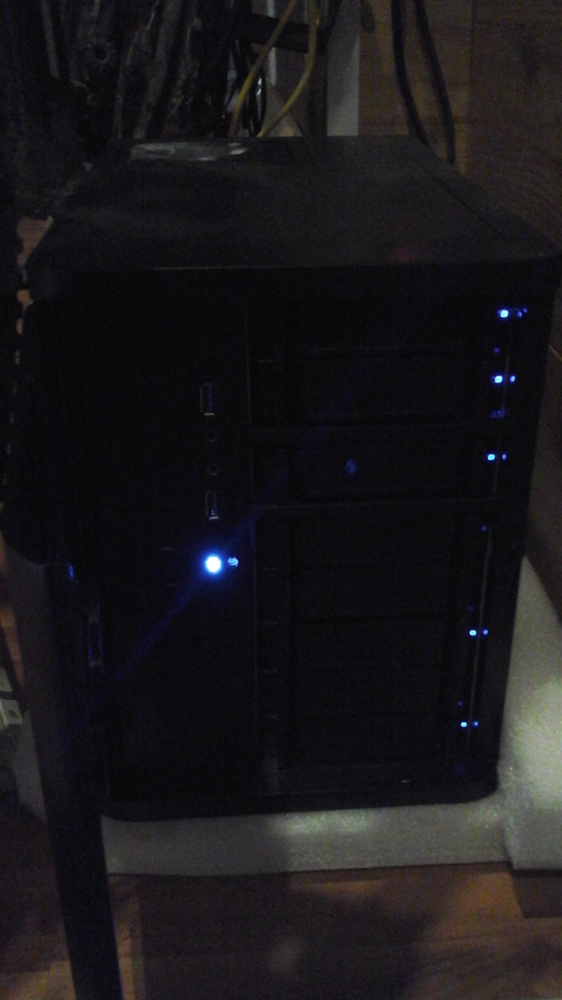](images/7cid5k-aqzmsj4tfobofqftiuhu.jpeg)

Вид изнутри, основная дисковая корзина на месте:
[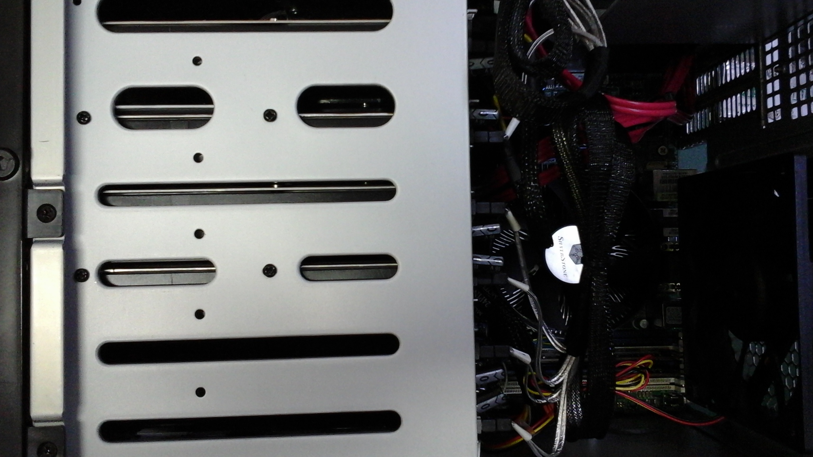](images/paczyj0_cadxrmywor-9o_t1zgi.jpeg)

Вид изнутри, дисковые корзины сняты:
[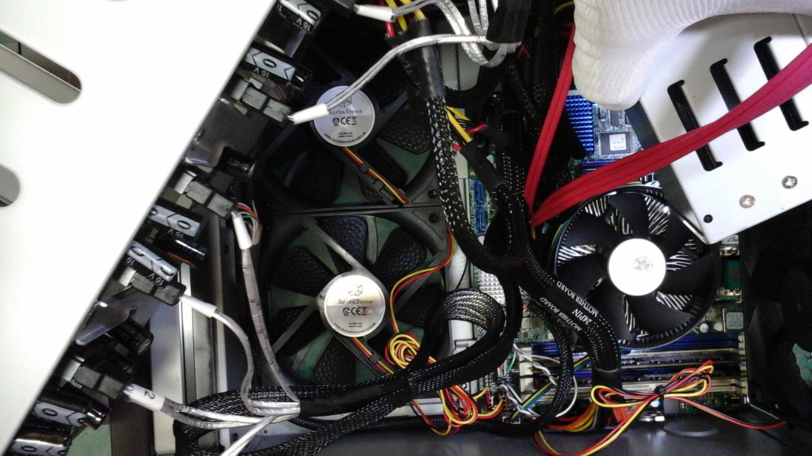](images/9xmtw3ngvo9y0cbmo2251okqzyi.jpeg)

[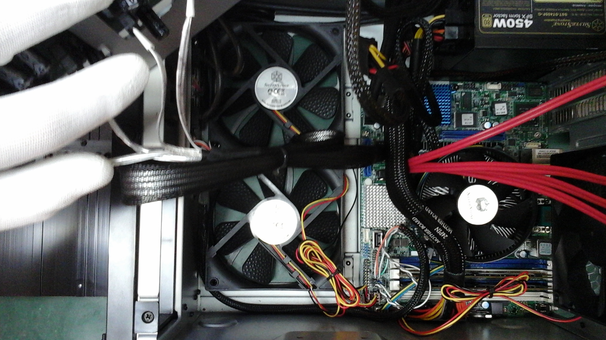](images/64xsmuvduqp0ijtzuwazim1qzdq.jpeg)
</spoiler>

## Когда действительно стоит

Есть несколько причин, когда сборка собственного NAS имеет смысл:

- Когда вам это ничего не стоит. Если имеются лишние компьютеры и компоненты, действительно возможно сделать его дешевле. Также, если вы можете по низкой цене купить серверное оборудование, доставку которого вам не придётся оплачивать.
- Рынок не предлагает решения для вас. Такую ситуацию представить сложно, но возможно. У вас может быть ограничен бюджет, список производителей, набор компонентов, использоваться высоко специфичная конфигурация, секретность и т.п..
- У вас много свободного времени и денег, при этом нечем заняться. В таком случае ресурсы возможно потратить на что угодно, в том числе и на сборку NAS.
- Вы энтузиаст и хотите собрать NAS самостоятельно. Всё понятно. Без комментариев.
- Вы хотите разобраться в некоторых технологиях, изучить рынок, ~~пропатчить операционную систему~~, понять "как это работает".

Может быть ещё один вариант: вы хотите выйти на рынок со своим NAS. Хотя, вряд ли вы будете читать эту статью в таком случае. И, как я уже говорил, рынок NAS достаточно насыщен, потому я не вижу в этом особого смысла.

### Небольшое дополнение

Диски в составе моего NAS стоят порядка **$1000**. В итоге, я получаю мощное серверное железо за чуть более, чем **$2000**. Synology на Intel Xeon D-1527 стоит от $2500 до $3100.
Если же вычесть сумму доставки компонент - $470, я получаю NAS приблизительно за **$1600**.
По такой цене возможно найти только решения на Atom или на ARM.

## Благодарности

Хочу поблагодарить Власова Алексея и Ершова Сергея за анализ и проверку статьи, замечания по материалу и исправление ошибок.

Отдельное спасибо пользователю @PeterZha за ценные дополнения к статье.
Спасибо @ACooper за дополнение по корпусам.
@Am0ralist за то, что дополнил информацию по HP Microserver.
За корректировки статьи благодарю @reff .
